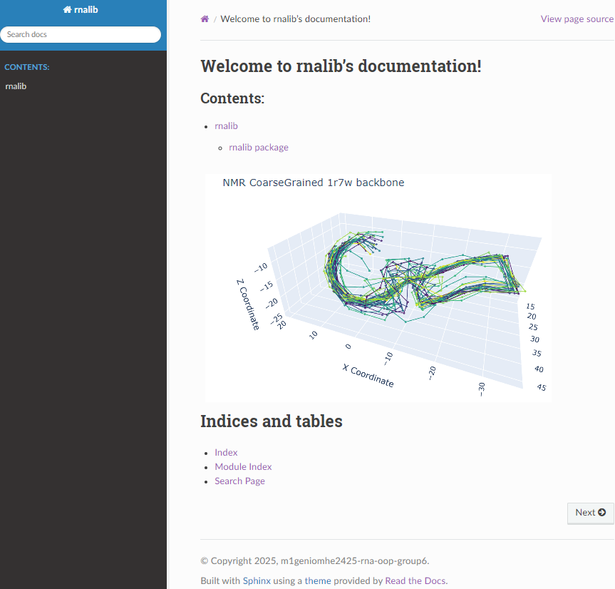

# 2425-m1geniomhe-oop2-labs

<!-- _Online demo available as soon as it becomes public:_   <a href="https://colab.research.google.com/github/rna-oop/2425-m1geniomhe-group-6/blob/main/demo.ipynb" target="_parent"></a>  -->


[](https://github.com/rna--oop/2425-m1geniomhe-group-6) [](https://www.python.org/downloads/release/python-390/)     [](./dev/changelog.md)   [](./docs/_build/html/index.html) [](./demo.ipynb)
<!-- deployed badge -->


* Joelle ASSY ([@JoelleAs](https://github.com/joelleas))
* Rayane ADAM ([@raysas](https://github.com/raysas))

## Modeling a Library for the Manipulation of Ribonucleic Acids (RNAs)
The goal of this series of labs is to build a library that allows easy manipulation and study of RNA sequences.

## Table of Contents
- [2425-m1geniomhe-oop2-labs](#2425-m1geniomhe-oop2-labs)
  - [Modeling a Library for the Manipulation of Ribonucleic Acids (RNAs)](#modeling-a-library-for-the-manipulation-of-ribonucleic-acids-rnas)
  - [Table of Contents](#table-of-contents)
  - [Labs](#labs)
    - [Lab1](#lab1)
    - [Lab2](#lab2)
    - [Lab3](#lab3)
    - [Lab4](#lab4)
  - [Overview of Library Functionalities](#overview-of-library-functionalities)
  - [Class Diagram](#class-diagram)
  - [Object Diagram](#object-diagram)
  - [Library Structure](#library-structure)
  - [Overview of Modules Implementation and Design Patterns](#overview-of-modules-implementation-and-design-patterns)
    - [Structure Module](#structure-module)
    - [Families Module](#families-module)
    - [IO Module](#io-module)
      - [Visitor Design Pattern](#visitor-design-pattern)
    - [Processing Module](#processing-module)
      - [Builder Design Pattern](#builder-design-pattern)
    - [Transformations Module](#transformations-module)
      - [Chain of Responsibility Design Pattern](#chain-of-responsibility-design-pattern)
    - [Visualizations](#visualizations)

## Installation

This library can be installed directly from github through pip:
```python 
pip install git+git://github.com/rna-oop/2425-m1geniomhe-group-6.git
```

_Online demo available as soon as it becomes public:_   <a href="https://colab.research.google.com/github/rna-oop/2425-m1geniomhe-group-6/blob/main/demo.ipynb" target="_parent"></a> 

Documentation of the various functions and classes can be found in a [`Sphinx generated read-the-docs-like webpage`](./docs/_build/html/index.html) or in the docstrings of the code. _Not deployed on github pages yet because the repo is private._

<p align='center'>

</p>


## Labs
### Lab1
[description](lab1/lab1.pdf) | [report](lab1/README.md) | [contents](lab1/)

### Lab2
[description](lab1/lab2.pdf) | [report](lab2/README.md) | [contents](lab2/)

### Lab3
[description](lab1/lab3.pdf) | [report](lab3/README.md) | [contents](lab3/)

### Lab4
[description](lab1/lab4.pdf) | [report](lab4/README.md) | [contents](lab4/)


## Overview of Library Functionalities
The library is designed to manipulate and study RNA sequences. It provides functionalities for:
- Creating and manipulating RNA molecules objects.
- Reading PDB file and creating an RNA molecule object or a numpy array of coordinates. 
- Writing PDB and XML files from an RNA molecule object.
- Reading multiple PDB files into a single numpy array of sequences, and another numpy array of coordinates.
- Creating a Pipeline of Transformations on the sequences and coordinates arrays:
  - Normalize by cropping or padding the sequences.
  - Kmers
  - OneHotEncoding for a sequence or kmers. 
  - Distograms, specific atoms can be given, and there is an option to bucketize the distances.
  - Secondary Structure prediction (dot-bracket notation) using Nussinov algorithm or Watson-Crick distances. 
  - Tertiaty Motifs detection (hairpins, internal loops, bulges). 
- Visualizations for the following:
  - RNA molecule coarse grained models in 3D.
  - OneHotEncoding of the sequence or kmers.
  - Distogram.
  - Secondary structure in arcs, network, or 2D.


## Class Diagram

Each color represents a different module, and opacity variations indicate different submodules.

- [x] Section related to RNA object manipulation: structure in purple  , family in blue  (lab1)
- [x] Section related to reading/writing in yellow  and green  (lab2 & lab3) ; Builder and Visitor
- [x] Section related to transformations and pipeline construction in red  (lab4) ; Chain of Responsibility 

## Object Diagram


## Library Structure

The classes are organized in modules and submodules as follows:

```text
.
├── Families
│   ├── __init__.py
│   ├── clan.py
│   ├── family.py
│   ├── species.py
│   └── tree.py
├── IO
│   ├── RNA_IO.py
│   ├── __init__.py
│   ├── parsers
│   │   ├── PDB_Parser.py
│   │   ├── RNA_Parser.py
│   │   └── __init__.py
│   └── visitor_writers
│       ├── __init__.py
│       ├── pdb_visitor.py
│       ├── visitor.py
│       └── xml_visitor.py
├── Processing
│   ├── ArrayBuilder.py
│   ├── Builder.py
│   ├── Director.py
│   ├── ObjectBuilder.py
│   └── __init__.py
├── Structure
│   ├── Atom.py
│   ├── Chain.py
│   ├── Model.py
│   ├── RNA_Molecule.py
│   ├── Residue.py
│   ├── Structure.py
│   └── __init__.py
├── Transformations
│   ├── Pipeline.py
│   ├── __init__.py
│   └── transformers
│       ├── BaseTransformer.py
│       ├── Distogram.py
│       ├── Kmers.py
│       ├── Normalize.py
│       ├── OneHotEncoding.py
│       ├── SecondaryStructure.py
│       ├── TertiaryStructure.py
│       ├── Transformer.py
│       └── __init__.py
├── utils.py
└── viz.py
```

##  Overview of Modules Implementation and Design Patterns

### Structure Module

The `Structure` module is responsible for representing the RNA molecule and its components. It contains the hierarchical structure of the RNA molecule, including models, chains, residues, and atoms. The classes in this module are designed to work together to provide a comprehensive representation of the RNA structure.

**Structure class**:

An interface for all the classes in the Structure module. It enforces the implementation of the `accept` method, which is part of the Visitor design pattern that we will discuss later.

**Common Implementation**:

- Encapsulation and Validation: Attributes are accessed through `getters` and `setters`, ensuring data integrity and type validation.
- String Representation: The `__repr__` method provides a clear textual representation of objects.
- Hierarchical Data Storage:
  - Parent classes (RNA_Molecule, Model, Chain, Residue) store their children in `dictionaries`, enabling efficient access and manipulation.
  - Child classes (Atom, Residue, Chain, Model) maintain a `reference to their parent`, ensuring bidirectional navigation of the structure.
- Controlled Data Modification:
  - Parent classes have methods to `add`, `remove`, and `get` children while maintaining structural consistency.
  - Objects can be `initialized with existing children`, allowing flexible structure creation.
  
**Atom class**:
- Attributes: name, x, y, z, element, altloc=None, occupancy=None, temp_factor=None, charge=None
- Enum for the atom elements (C, N, O, P, H)

**Residue**:
- Attributes: type, position, i_code=None, atoms=None
- Enum for the residue types (A, C, G, U)

**Chain**:
- Attributes: id, residues=None

**Model**:
- It represents a model in the PDB file.
- A molecule can have multiple models (usually in NMR files).
- Attributes: id, chains=None

**RNA_Molecule**:
- It represents the entire RNA molecule.
- It contains multiple models, each with multiple chains.
- Attributes: entry_id, experiment=None, species=None, models=None

---

### Families Module

The `Families` module represents the evolutionary and comparitive relationships between RNA sequences. It's a module composed of several modules itself, where each contain a class of the same name.

**Family:** 
- It represents a family of RNA molecules, the way it's defined in the [`Rfam database`](https://rfam.xfam.org/).
- Has methods to add attributes the classes that are associated with it, and have support with `rfam api` to access information while creating an object found in the database.
- Has class attributes to ensure a family is instanciated once, dunder and helper private methods, and plotting methods to visualize distribution of species accross the family.
- Attributes: name: str, id: str, type: str, members: list, trees: dict, clan: Clan=None, entries[CLASS ATTRIBUTE]: list

**Clan:**
- Same as clan, but consititues a set of families that are related, aggregation of families.
- Attributes: id, name:str, members=list

**PhyloTree**:
- It represents a phylogenetic tree of RNA sequences belonging to a certain family, and designates a tree data structure allowing flexibility in accessing leaves (sequences) through tree traversals. 
- Built as one of the modules in the `tree` submodule, on top of a helper TreeNode class and can be created from a Newick string, with available api functionality to access the rfam's tree of a particular family. Several trees can belong to teh saem familty depnding on the source/algorithm usd, thus family has its tree attribute as a dict whose values are PhyloTree objects.
- Attributes: root: TreeNode, family: Family

**TreeNode**:
- Helper class, second module in teh `tree` submodule, representing a node in the phylogenetic tree. Supports node traversal algorithms, with necessary dunder methods for string representation,indexibality and equality checks.
- Attributes: name: str, children: dict, parent: TreeNode=None, distance: float=None

**Species:**
- It represents a living species, with its scientific name. Supports only one instance of a spcies once declared, keeping track in a class attribute (for effifient database design). It appends every rna molecule that is present in a species instance to that instance through a dictionary, and has a method to get them.
- Attributes: name: str, family: dict={}, declared_species [CLASS ATTRIBUTE]: list

### IO Module

The `IO` module is responsible for reading and writing RNA structures from and to various file formats.

**RNA_IO class**:

- It serves as a user interface for reading and writing.
- It contains a dictionary of parsers and writers for different formats. 
- Currently, it supports `PDB` format for reading and PDB, `XML` or PDBML formats for writing.
- The `read` method reads a file of a specific format and returns either a numpy array or an RNA molecule object, depending on the `array` parameter.
- The `write` method writes an RNA molecule object to a file of a specific format.

**RNA_Parser class**:
- It defines the interface for all parsers, to implement the `read` method.

**PDB_Parser class**:

- Method: `read(path_to_file, coarse_grained=False, atom_name="C1'", array=True)`
    - path_to_file (str) – Path to the PDB file.
    - coarse_grained (bool, default=False) – Extract only a specific atom per residue (e.g., C1' for RNA backbones).
    - atom_name (str, default="C1'") – The atom to extract when coarse_grained=True.
    - array (bool, default=True) – Return a **NumPy arrays for Sequences and Coordinates** if True, otherwise an **RNA_Molecule object**.

- Uses the Builder pattern (Director & Builder classes) for structured data construction.
- Extracts PDB metadata (ID, experiment type, species) via `_extract_molecule_info()`.
- Extracts atom info (atom attributes, residue attributes, chain attribute) via `_extract_atom_info()`.
- Supports multi-model structures, assigning atoms to their respective models.

### visitor_writers Module

This module is home to the Visitor design pattern, part of teh IO subpackage due to its involvement in writing and exporting files from the RNA_Molecule object.

#### Visitor Design Pattern

#### Visitor Design Pattern

The Visitor pattern is used to export an RNA molecule object into different file formats:
1. **PDBExportVisitor** → Exports to `PDB`
2. **XMLExportVisitor** → Exports to `PDBML/XML` (more about the format [in lab3 writing section](./lab3/README.md#2-writing-structures-into-pdmlxml-format))

**Visitor interface**:

- Allows the creation of various file formats exporters, referred to as "visitors" and enforces the implementation of visit methods since it's an interface
- Defines `visit_Atom()`, `visit_Residue()`, `visit_Chain()`, `visit_Model()`, and `visit_RNA_Molecule()` methods to format data.
- `export(rna: RNA_Molecule)` method calls the visit methods to write the file.

**Structure interface**:

- Created to enforce a structural entity nature on all classes in the `Structure` module by implementing the it.
- Defines `accept(visitor)`, implemented by `Atom`, `Residue`, `Chain`, `Model`, and `RNA_Molecule`.
- Calls the corresponding `visit_*()` method in the visitor.

**PDBExportVisitor class**:

- Implements `Visitor` interface.
- Formats RNA molecule data into `PDB` format.
- `export(rna)` writes the `PDB` file using visit methods.

**XMLExportVisitor class**:

- Implements `Visitor` interface.
- Formats RNA molecule data into `PDBML/XML` format.
- `export(rna)` writes the `XML` file using visit methods.

This design separates export functionality from the `RNA_Molecule` class, ensuring modularity and flexibility.

**Advantages of the Visitor Pattern:**  
- The Visitor Pattern separates the logic of traversing the molecular structure from the operations applied to it. Instead of having the `RNA_Molecule` class handle both data representation and output formatting, the visitor encapsulates format-specific logic, keeping `RNA_Molecule` focused on molecular structure representation. 
- It supports adding new output formats (_e.g., CSV, JSON_) at any point in development without modifying existing code, adhering to the open-closed principle. _(Met in the previous implementation)_  
- Formatting is split across different structural elements separately, improving code readability and maintainability. However, this also increases code complexity (as discussed in disadvantages).  
- The ability to accept a visitor from any object in the structure adds flexibility, allowing the structure to be represented as needed in the file. However, this feature is not actively used in the current implementation, as the `RNA_IO` class manages the writing process directly.  

**Disadvantages of the Visitor Pattern:**  
- **Increased complexity:** The previous implementation handled writing separately from `RNA_Molecule`, similar to the visitor pattern, but in a more direct manner. By flattening the molecule object into a list of atoms and formatting it for output, it kept the molecule representation decoupled from the writing process. The visitor pattern, in contrast, integrates traversal and formatting, making the design more structured but also more intricate.


### Processing Module

The `Processing` module is responsible for building RNA molecules and arrays from PDB files. It uses the Builder design pattern to create complex objects step by step.


#### Builder Design Pattern

The Builder pattern is used to construct different representations of an RNA molecule:
1- Object-Oriented Representation (ObjectBuilder)
2- NumPy Array Representation (ArrayBuilder)

**Director class**:

- The `Director` class serves as a director for the `Builder` classes. 
- Attribute: `__builder`: The builder object that will be used to build the object. Initialized to `None`.
- It provides a common recipe in `add_atom_info(model_id, *atom_info)` for the builder classes to follow.

**Builder class**:

- It defines the interface for the concrete builders:
    - `molecule` (property) → Returns the final structure.
    - `reset()` → Resets the builder.
    - `add_model()`, `add_chain()`, `add_residue()`, `add_atom()` → Methods for constructing the hierarchy. 

**ObjectBuilder class**:

- It constructs an RNA molecule object step by step using the Builder interface.
- Attributes:
    - `__molecule` → Stores the RNA molecule being built.
    - `__model_id`, `__chain_id`, `__residue_id` → Track the current model, chain, and residue IDs.
- Methods: have the same names as the Builder interface methods and an additional method:
    - `add_molecule_info(entry_id, experiment, species)` → Stores general metadata (entry ID, experiment type, and species).

**ArrayBuilder class**:
- It constructs a numpy array representation of the RNA molecule step by step using the Builder interface.
- Attributes:
    - `__array` → Stores atom coordinates for each residue.
    - `__sequence` → Stores residue names for sequence representation.
    - `__model_id`, `__residue_id` → Track the current model and residue IDs.
    - `__prev_atom` → Tracks the last atom name and occupancy to handle alternate locations.
- Methods: have the same names as the Builder interface methods.
    - `molecule` (property) → Converts stored data into two numpy arrays:
        - **np_sequence**: `(models, max_residues)` array storing residue names.
        - **np_array**: `(models, max_residues, max_atoms, 3)` array storing atom coordinates.

***Disadvantages of the Builder Pattern:***
- The Builder Design Pattern adds complexity by introducing additional classes and methods.
  
**Advantages of the Builder Pattern:**
- Each representation has its own dedicated builder class, making the code cleaner and more maintainable, especially for future additions.
- It enables the direct construction of the required representation without unnecessary intermediate objects if we want to decouple parsing from representation.
- It ensures consistency by providing a single construction recipe common to all representations, reducing redundancy and potential errors.
- It breaks the construction into smaller steps, allowing for easier modification or extension.

---

### Transformations Module

The `Transformations` module is responsible for applying various transformations to RNA sequences and coordinates. It uses the Chain of Responsibility design pattern to handle a series of transformations in a flexible and extensible manner.

#### Chain of Responsibility Design Pattern

The Chain of Responsibility pattern allows multiple handlers to process a request without the sender needing to know which handler will ultimately handle it. In this module, each transformation is represented as a handler in the chain. Each transformer transforms the data and passes it to the next transformer in the chain.

**Pipeline class**:
- The `Pipeline` class is the main entry point for applying transformations to RNA sequences and coordinates.
- It takes a list of transformers as input and ensures that they are valid transformer classes.
- The first transformer in the chain must be a `Normalize` transformer (if present).
- It sets the next transformer in the chain for each transformer, allowing for a flexible and extensible design.
- The `transform` method starts the transformation process from the first transformer in the chain, passing the input data (X, Y) through each transformer in sequence.
- The `__repr__` method provides a string representation of the pipeline, including the names and parameters of each transformer in the chain.

**Transformer class**:
- The `Transformer` class is an interface for all transformers.
- It defines the `set_next` method to set the next transformer in the chain and the `transform` method to perform the transformation.

**BaseTransformer class**:
- The `BaseTransformer` class is an abstract base class for all transformers.
- It implements the `set_next` method to set the next transformer in the chain.
- It defines the `transform` method as an abstract method, which must be implemented by concrete transformer classes.

**Concrete Transformers**:
- **Normalize**: Normalizes the input data by cropping or padding sequences to a fixed length.
- **Kmers**: Generates k-mers from the input sequences.
- **OneHotEncoding**: Encodes sequences or k-mers into one-hot encoded vectors.
- **Distogram**: Generates a distogram from the input coordinates, with options for specific atoms and bucketization.
- **SecondaryStructure**: Predicts the secondary structure (dot-bracket format) of the RNA molecule using the Nussinov algorithm or Watson-Crick distances.
- **TertiaryMotifs**: Detects motifs (hairpins, internal loops, bulges) from the dot-bracket format.

**Order Constraints**:
- The first transformer in the chain must be a `Normalize` transformer (if present).
- The `Kmers` transformer must be before the `OneHotEncoding` transformer.
- The `SecondaryStructure` transformer must be before the `TertiaryMotifs` transformer.
- The `Kmers` cannot be before the `SecondaryStructure` transformer.

**For more details on each transformer, please refer to [lab4/README.md](lab4/README.md).**

**Disadvantages of the Chain of Responsibility Pattern:**
- Can lead to a large number of classes.
- The sequence of transformers is important, requiring careful consideration when changed.
  
**Advantages of the Chain of Responsibility Pattern:**
- Allows for a flexible and extensible design, where new transformers can be added or removed without modifying existing code.
- It promotes the single responsibility principle, as each transformer is responsible for a specific transformation.
- It allows for dynamic composition of transformers, enabling different combinations of transformations to be applied based on user needs.
- It decouples the sender and receiver of the request, allowing for a more modular design.
- It provides a clear and organized structure for handling a series of transformations, making it easier to understand and maintain the code.
- It allows for easy testing and debugging of individual transformers, as they can be tested in isolation.
- It enables the reuse of transformers across different pipelines, reducing code duplication.

---

### Visualizations