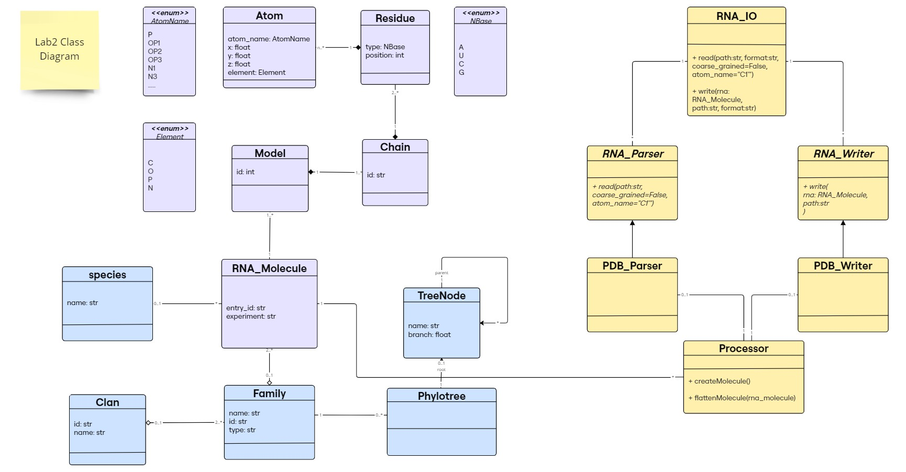
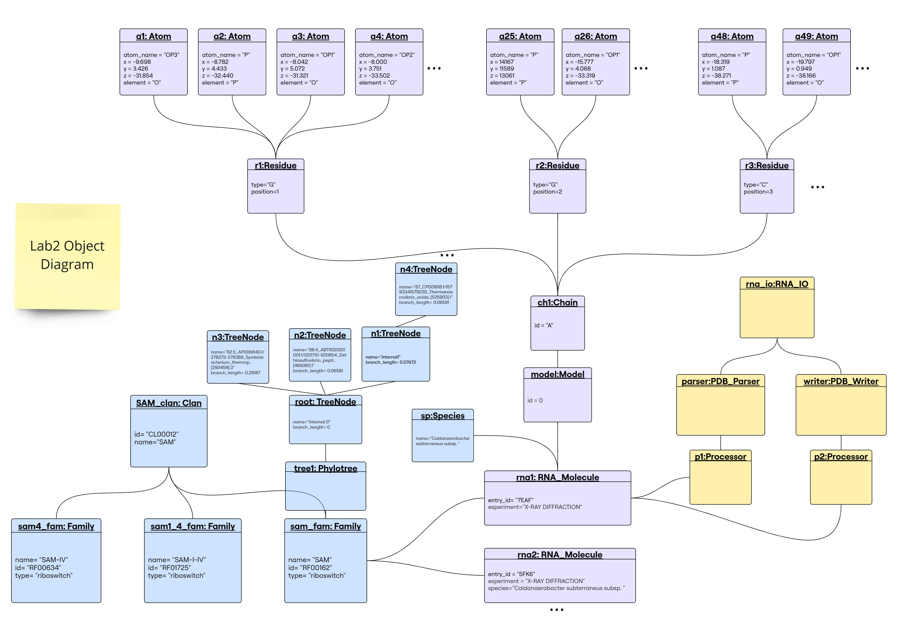
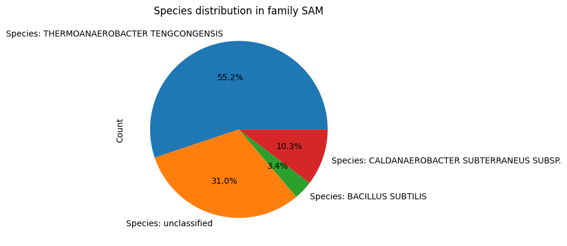

# Lab 2 Report

## Table of contents

- [Lab 2 Report](#lab-2-report)
  - [Table of contents](#table-of-contents)
  - [Demo test on python notebook](#demo-test-on-python-notebook)
  - [Class Diagram](#class-diagram)
  - [Object Diagram](#object-diagram)
  - [Implementation](#implementation)
    - [Extensions](#extensions)
      - [Directory Structure](#directory-structure)
      - [Handling 1-N Relationships](#handling-1-n-relationships)
    - [Code Explanation](#code-explanation)
      - [`RNA_IO` Class](#rna_io-class)
      - [`RNA_Parser` and `RNA_Writer` Classes](#rna_parser-and-rna_writer-classes)
      - [`PDB_Parser` Class](#pdb_parser-class)
      - [`PDB_Writer` Class](#pdb_writer-class)
  - [](#)
      - [`Processor` Class](#processor-class)
  - [Decoupling Analysis](#decoupling-analysis)


## Demo test on python notebook

This demo shows how the user will use the code.

Demo directory:

```text
lab2/
└── demo
   ├── demo.ipynb              # main demo demonstrating reading and writing
   └── demo-extensions.ipynb   # demo for extension features
```

[](./demo/demo.ipynb)  [](./demo/demo-extensions.ipynb)

 [](./demo/demo-extensions.ipynb)


## Class Diagram

<p align='center'>

<figcaption align='center'>Class Diagram</figcaption>
</p>

As a minor enhancement to the previous lab design, we added `Species` entity to represent a class Species that is associated with `RNA_Molecule`. Instead of using attribute `species` in `RNA_Molecule` class as string type, it is now of `Species` type. An `RNA_Molecule` can have 1 `Species` or none (e.g., if it is synthetic). A `Species` can have many `RNA_Molecule` instances.

For the purpose of this lab (reading/writing to a file), new classes have been introduced in yellow in this diagram: 

1. **`RNA_IO` (User Interface for I/O Operations)**
    - Serves as the interface for reading and writing RNA sequence files.
    - Provides two methods:
        - `read(path, format, coarse_grained=False, atom_name=None)` → `RNA_Molecule`
            - Parses a file and returns an RNA_Molecule instance.
            - Optional parameters:
                - `coarse_grained`: If True, extracts only a subset of atoms for a simplified representation.
                - `atom_name`: Allows specifying a particular atom type to extract.
        - `write(rna_molecule, file_path, format)`
            - Writes an `RNA_Molecule` instance to a file.
    - Handles multiple file formats by relying on specialized `parsers` and `writers` for format-specific processing → can have many parsers and writers.


2. **Parsing** 
    - `RNA_Parser` (Abstract Class)
        - Defines the abstract method `read()`, enforcing child classes to implement format-specific parsing.
    - `PDB_Parser` (Concrete Class)
        - Implements `read()`, processing PDB files to create an RNA_Molecule instance.


3. **Writing**
    -  `RNA_Writer` (Abstract Class)
       - Defines the abstract method `write()`, ensuring all writers implement format-specific writing.
    - `PDB_Writer` (Concrete Class)
        - Implements `write()`, converting an RNA_Molecule instance into a PDB file.


4. **`Processor` (RNA Structure Representation Handler)**
    - An intermediary between parsers/writers and RNA_Molecule.
    - Converts parsed content into an RNA_Molecule instance.
    - Flattens an RNA_Molecule into a list of atoms for writing.
    - Associations:
        - `PDB_Parser` uses a `Processor` to construct `RNA_Molecule`.
        - `PDB_Writer` uses a `Processor` to extract relevant data for writing.
        - An `RNA_Molecule` can be associated with multiple `Processor` instances.
        - A `Processor` can belong to at most one `parser` or one `writer` (0..1 relationship). 


5. **Design Choice**
    - Decoupling:
        - RNA_IO provides a simple interface for users.
        - Parsers and Writers handle format-specific operations.
        - Processor ensures proper RNA representation.
    - Extensibility:
        - New formats (e.g., FASTA) can be supported by adding corresponding RNA_Parser and RNA_Writer subclasses.

---

## Object Diagram

<p align='center'>

<figcaption align='center'>Object Diagram</figcaption>
</p>

- `rna_io` object instantiated by the user to read and write.
- `pdb_parser` object created by `rna_io` to parse PDB files.
- `pdb_writer` object created by `rna_io` to write PDB files.
- `p1` object of class `Processor` created by `pdb_parser` to handle RNA structure representation and create an `RNA_Molecule` object.
- `p2` object of class `Processor` created by `pdb_writer` to extract atoms list from `RNA_Molecule` for writing (by handling the RNA structure representation). 

--- 

## Implementation 

The implementation of the classes is available in the [src](https://github.com/rna-oop/2425-m1-geniomhe-group-6/tree/main/lab2/src) directory.

The classes are organized in modules and submodules as follows:

```text
src/
├── Families
│   ├── __init__.py
│   ├── clan.py
│   ├── family.py
│   ├── species.py
│   └── tree.py
├── IO
│   ├── RNA_IO.py
│   ├── __init__.py
│   ├── parsers
│   │   ├── PDB_Parser.py
│   │   ├── RNA_Parser.py
│   │   └── __init__.py
│   └── writers
│       ├── PDB_Writer.py
│       ├── RNA_Writer.py
│       └── __init__.py
├── Structure
│   ├── Atom.py
│   ├── Chain.py
│   ├── Model.py
│   ├── RNA_Molecule.py
│   ├── Residue.py
│   └── __init__.py 
├── processor.py
└── utils.py
```

### Extensions

_Some enhancements on the library design that are worth of mention:_

#### Directory Structure

In lab1, we had a flat directory structure. In lab2, we have introduced a new directory structure to better organize the code into modules and submodules, as seen in [Implementation Section](#implementation). This structure helps in managing the codebase effectively and allows for better organization of related classes and functionalities.

The interdependencies between modules have been handled by appending the `src` directory to the pythonpath and importing the modules using absolute imports. Another alternative during the development stage (not a deployable library yet) is tu sue the [`set-pythonpath.sh`](../dev/set-pythonpath.sh) script in `dev/` directory.

#### Handling 1-N Relationships

Originally, if we have a 1-N relationship between two classes, _e.g., one Family have many RNA Molecules_, we would store a list of RNA Molecules in the Family class. This is a simple and straightforward approach. However, it has some drawbacks, as it makes us unable to tag each RNA Molecule with the Family it belongs to. To address this issue, we have added an attribute "family" to the RNA Molecule class, that the user has no interaction whatsoever with, but is rather set automatically through the code when the RNA Molecule is added to a Family. 

> [!IMPORTANT]
To ensure this behavior we have either not provided a setter for this attribute or raised a warning message if the user tries to set it manually. A private method has been implemented that acts as a setter for this attribute in the other class (_e.g., RNA_Molecule's `_add_family()` method will be used in Family's add_RNA() method through: `fam1.add_RNA(rna1)`; behind the scenes: `rna1._add_family(self)  `_).

This was done in all classes that have a 1-N relationship with another class.

#### Species class

In order to account for instanciated species, and because we dont wanna lose track of what we have created and the connection to each species with their types, we have implemenented a class attribute `declared_species` that ensures:  
* unicity of a species instance 
* ability to access and point to equivalent species instances

This is particularly helpful with the 1-N relationship `Species` have with `RNA_Molecule` instances. 1 RNA-Molecule instance can be found in 1 Species, but 1 Species can have multiple RNA_Molecule instances. Thus we have added an attribute in Species that stores a dictionary of RNA_Molecule instances, with the key being the RNA_Molecule instance's id (to enhance lookup speed using the dict's inherent hashing compared to looping through a list). And for the relationship to be well implemented, we have added a `species` attribute in the RNA_Molecule class that points to the Species instance it belongs to. The latter is only set by appending an RNA_Molecule instance to a Species instance, and not by setting it directly (automatic handling). In this way, the `declared_species` class attribute ensures that one species instance can have multiple RNA_Molecule instances.  
_e.g., rna molecule 1 associated with E.coli species, rna molecule 2 associated with E.coli species, we would find only one E.coli species instance in the declared_species attribute, with the two RNA_Molecule instances in its rna molecules dictionary corresponding to rna1 and rna2_

A species class have been implemented to account for them as entities that might have several RNA moelcules associated with them. To keep track of previously created species, we have implemented a class attribute `declared_species` that ensures unicity of species instances and ability to access and point to equivalent species instances. This is particularly helpful with the 1-N relationship between Species and RNA molecule. 1 RNA molecule instance can be found in 1 Species, but 1 Species can have multiple RNA molecule instances, so an instanciated species would have a dictionary of RNA molecule instances, with the key being the RNA molecule instance's id, and value of type `RNA_Molecule`. This way, we can easily access the RNA molecule instances associated with a species instance ( a dict instead of a list to enhance lookup speed using the dict's inherent hashing compared to looping through a list).

And for the relationship to be well implemented, we have added a `species` attribute in the RNA_Molecule class that points to the Species instance it belongs to. The latter is only set by appending an RNA_Molecule instance to a Species instance, and not by setting it directly (automatic handling). In this way, the `declared_species` class attribute ensures that one species instance can have multiple RNA_Molecule instances.  

_e.g., rna molecule 1 associated with E.coli species, rna molecule 2 associated with E.coli species, we would find only one E.coli species instance in the declared_species attribute, with the two RNA_Molecule instances in its rna molecules dictionary corresponding to rna1 and rna2_

Since Species has a relationship with RNA_Molecule, and Family has a relationship with RNA_Molecule, an additional functionality that is now avaliable to teh user is the ability to see the distribution of species in a family. This is done by calling the `distribution()` method in the Family class, which returns a data frame of species and the number of RNA_Molecule instances associated with them. For visualiztion, the user can call the `plot_distribution()` method in the Family class, which plots a pie plot of the species distribution.

```python
fam=Family(id='SAM',name='SAM')
fam.plot_distribution()
```



### Code Explanation 

#### `RNA_IO` Class

- Responsible for managing the input and output operations of RNA molecule data. It provides methods for reading RNA molecule representations from files and writing them back to files in various formats. 


- This is the class that the user interacts with to read and write RNA molecule data.


- **Constructor**:

    The class is initialized with two private dictionaries:
    - `__parsers`: Contains instances of parsers for different file formats. Currently, it includes the PDB format parser.
    - `__writers`: Contains instances of writers for different file formats. Currently, it includes the PDB format writer.

    ```python
        def __init__(self):
            self.__parsers = {"PDB": PDB_Parser()}
            self.__writers = {"PDB": PDB_Writer()}
    ```


- **Methods**:

    1. `read(path_to_file, format, coarse_grained=False, atom_name="C1'")`
        - Purpose: Reads a file of the specified format and returns an `RNA_Molecule` object.
        - Parameters:
          - `path_to_file`: The path to the file to be read.
          - `format`: The format of the file being read (e.g., "PDB").
          - `coarse_grained`: A boolean flag indicating whether to use a coarse-grained representation, defaults to `False`.
          - `atom_name`: The name of the atom to be read, defaults to `"C1'"` because:
            - It defines the sugar ring attachment point to the base.
            - It’s commonly used in coarse-grained RNA models.
            - It provides a stable reference point per residue.
        - Returns: An `RNA_Molecule` instance.
        - Raises: `ValueError` if the specified format is not supported.

        ```python
        def read(self, path_to_file, format, coarse_grained=False, atom_name="C1'"):
            if format not in self.__parsers:
                raise ValueError(f"Format {format} is not supported.")
            parser = self.__parsers[format]
            return parser.read(path_to_file, coarse_grained, atom_name)
        ```
        The method first checks if the specified format is supported by the RNA_IO instance. If the format is supported, it retrieves the corresponding parser from the `__parsers` dictionary and calls its `read` method to parse the file and return an `RNA_Molecule` instance.


    1. `write(rna_molecule, path_to_file, format)`
        - Purpose: Writes an `RNA_Molecule` object to a file of the specified format.
        - Parameters:
          - `rna_molecule`: The RNA molecule object to be written to the file.
          - `path_to_file`: The path where the file will be written.
          - `format`: The format of the file to be written (e.g., "PDB").
        - Raises: `ValueError` if the specified format is not supported.
        - Calls the `write` method of the corresponding writer for the specified format to write the RNA molecule to the file.
        
--- 

#### `RNA_Parser` and `RNA_Writer` Classes

- These are abstract classes that define the interface for parsers and writers, respectively. They enforce the implementation of the `read` and `write` methods in concrete subclasses.

    ```python
    class RNA_Parser(ABC):
        
        @abstractmethod
        def read(self, path_to_file):
            pass
    ```

    ```python
    class RNA_Writer(ABC):
        
        @abstractmethod
        def write(self, rna_molecule, path_to_file):
            pass
    ```
---

#### `PDB_Parser` Class

- Concrete subclass of `RNA_Parser` that implements the `read` method for parsing PDB files and creating an `RNA_Molecule` instance.


- **`read` method**:

    ```python
    def read(self, path_to_file, coarse_grained=False, atom_name="C1'"):
        """
        Reads a PDB file and returns the RNA molecule object.
        """
        processor=Processor() #To handle the molecule representation in the processor class
        
        #Extract RNA_Molecule Attributes and store them in the processor object
        molecule_info = self._extract_molecule_info(path_to_file)
        processor.molecule_info(*molecule_info)
        
        #Extract the atoms and store them in the processor object
        with open(path_to_file, 'r') as pdb_file:
            
            model_id = 0 
        
            for line in pdb_file:
                if line.startswith("MODEL"):
                    model_id = int(line.split()[1])  #Extract model ID
                    
                elif line.startswith("ATOM"):
                    if coarse_grained:
                        if line[12:16].strip() == atom_name:
                            atom_info = self._extract_atom_info(line)
                            if atom_info is not None:
                                processor.atom_info(*atom_info, model_id)
                    else:
                        atom_info = self._extract_atom_info(line)
                        if atom_info is not None: #It is None if the residue is not a nucleotide
                            processor.atom_info(*atom_info, model_id)
                    
        return processor.createMolecule() #Create the RNA_Molecule object
    ```

    1. **Processor Initialization**:
        - A `Processor` instance is created to handle the molecule representation.
    2. **Extract Molecule Info**:
        - The method `_extract_molecule_info` is called to extract the relevant information about the RNA molecule from the PDB file.
        - The extracted information is stored in the `Processor` object.
    3. **Extract Atoms**:
        - The PDB file is read line by line.
        - If the line starts with "MODEL", the model ID is extracted.
        - If the line starts with "ATOM", the atom information is extracted.
        - If `coarse_grained` is `True`, only atoms with the specified `atom_name` are extracted.
        - The extracted atom information is stored in the `Processor` object.
    4. **Create Molecule**:
        - The `Processor` object is used to create an `RNA_Molecule` instance.
        - The `RNA_Molecule` instance is returned.
  


- `_extract_molecule_info` private method:

    - This method reads the PDB file line by line and extracts the PDB ID, experiment, and species information.
    - The extracted information is returned as a tuple.
    - If the information is not found, the corresponding attribute is set to `None`.
    - The method stops reading the file once it encounters a line starting with "REMARK" or "ATOM".
    - This method is called by the `read` method to extract the molecule information before extracting the atoms.
    - The extracted information is stored in the `Processor` object for creating the `RNA_Molecule` instance.
    - It basically extracts the essential information needed to create an `RNA_Molecule` object. 
    - **It can be easily extended to extract additional information if needed or remove unnecessary data, without requiring any changes to the `read` method.**


- `_extract_atom_info` private method:

    ```python
        def _extract_atom_info(self, line):

        residue_name = line[17:20].strip()
        if residue_name not in ['A', 'C', 'G', 'U']:
            return None #Not a nucleotide
        residue_id = int(line[22:26].strip()) 
        i_code = line[26:27].strip()
        
        atom_name = line[12:16].strip()
        altloc = line[16:17].strip()
        x, y, z = map(float, [line[30:38], line[38:46], line[46:54]])
        occupancy = float(line[54:60].strip())
        temp_factor = float(line[60:66].strip()) if line[60:66].strip() else None
        element = line[76:78].strip()
        charge = line[78:80].strip()
        
        chain_id = line[21]
        
        return atom_name, x, y, z, element, residue_name, residue_id, chain_id, altloc, occupancy, temp_factor, i_code, charge
    ```
    - This method extracts the atom information from an atom line in a PDB file.
    - It returns a tuple containing the atom information.
    - If the residue is not a valid nucleotide (A, C, G, U), it returns `None`.
    - The extracted atom information includes the atom name, coordinates, element, residue name, residue ID, chain ID, alternate location indicator, occupancy, temperature factor, insertion code, and charge.
    - This method is called by the `read` method to extract atom information for creating the `RNA_Molecule` instance.
    - **It can be easily extended to extract additional atom information if needed or remove unnecessary data, without requiring any changes to the `read` method.**


---

#### `PDB_Writer` Class

- Concrete subclass of `RNA_Writer` that implements the `write` method for writing `RNA_Molecule` objects to PDB files.

- **`write` method**:

    ```python
    def write(self, rna_molecule, path_to_file):
        """
        Writes the RNA molecule object to a PDB-like file.
        Format:
        <Record name> <Serial> <Atom name> <AltLoc> <Residue name> <ChainID> <Residue sequence number> <ICode> <X> <Y> <Z> <Occupancy> <TempFactor> <Element> <Charge>
        """
        processor=Processor()
        atoms = processor.flattenMolecule(rna_molecule)  #Get a flat list of atoms

        with open(path_to_file, "w") as f:
            
            #Write molecule information
            molecule_info = self._format_molecule_info(rna_molecule)
            f.write(molecule_info)
            
            #Write atom information
            
            current_model = None

            for model_id, *atom_info in atoms:
                #Write MODEL record when a new model starts
                #If the model ID is 0, it means that there is only one model and no MODEL record is needed
                if model_id !=0 and model_id != current_model:
                    if current_model is not None:
                        f.write("ENDMDL\n")  #Close previous model
                    f.write(f"MODEL     {model_id}\n")
                    current_model = model_id
                
                #Write the formatted atom line
                pdb_line = self._format_atom_info(*atom_info)
                f.write(pdb_line)

            if model_id!=0:
                f.write("ENDMDL\n")  #Close the last model
            f.write("END\n")  #End of PDB file
                
        print(f"RNA molecule written to {path_to_file}")
    ```
    1. **Processor Initialization**:
        - A `Processor` instance is created because it handles the molecule representation.
    2. **Flatten Molecule**:
        - The `Processor` object is used to flatten the `RNA_Molecule` object into a list of atoms.
    3. **Write Molecule Info**:
        - The method `_format_molecule_info` is called to format the molecule information for writing to the PDB file.
        - The formatted molecule information is written to the file.
    4. **Write Atom Info**:
        - The atoms are iterated over, and the atom information is formatted using the method `_format_atom_info` for writing to the PDB file.
        - The formatted atom information is written to the file.
    5. **Write MODEL Records**:
        - If the model ID changes, a new MODEL record is written.
        - The MODEL record is closed when a new model starts.
    6. **End of File**:
        - The PDB file is closed with an "END" record.


- `_format_molecule_info` private method:
    - This method formats the molecule information (entry ID, experiment, species) in PDB format.
    - It extracts the relevant information from the `RNA_Molecule` object.
    - It formats the HEADER, SOURCE, and EXPDTA lines for the PDB file.
    - The formatted molecule information is returned as a string.
    - This method is called by the `write` method to write the molecule information to the PDB file.
    - **It can be easily extended to include additional information or modify the formatting without requiring changes to the `write` method.**


- `_format_atom_info` private method:
  
    - This method formats an atom entry into PDB format.
    - It extracts the relevant information from the atom such as atom attributes, residue, chain. 
    - It formats them according to the PDB format specification.
    - The formatted atom information is returned as a string.
    - This method is called by the `write` method to format the atom information for writing to the PDB file.
    - **It can be easily extended to include additional atom information or modify the formatting without requiring changes to the `write` method.**

---

#### `Processor` Class

- The `Processor` class acts as an intermediary between the parsers/writers and the `RNA_Molecule` class.
- It is used to hanldle the RNA structure representation.
- It contains methods to store the parsed content `molecule_info` and `atom_info`.
- It is responsible for converting the parsed content into an `RNA_Molecule` instance: `createMolecule()` method. 
- Also responsible for flattening an `RNA_Molecule` into a list of atoms for writing: `flattenMolecule(rna_molecule)`.

---

## Decoupling Analysis

The decoupling of parsing/writing from the RNA structure representation was demonstrated in the design and the implementation. 
