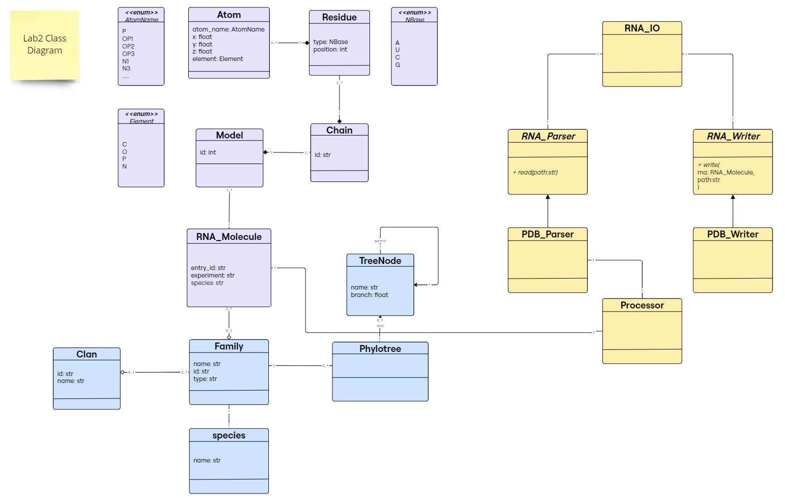

# Lab 2 Report

## Table of contents

- [Class Diagram](#class-diagram)
- [Implementation](#implementation)

demo test on colab:   
 

https://github.com/rna-oop/2425-m1-geniomhe-group-6/tree/main/lab2/src

## Class Diagram

<figcaption align='center'>Class Diagram (tentative)</figcaption>

For the purpose of this lab (reading/writing to a file), new classes have been introduced in yellow in this diagram. As a minor enhancement to the previous lab design, we added `Species` entity to represent a class Species that is associated with `Family`.

## Implementation
