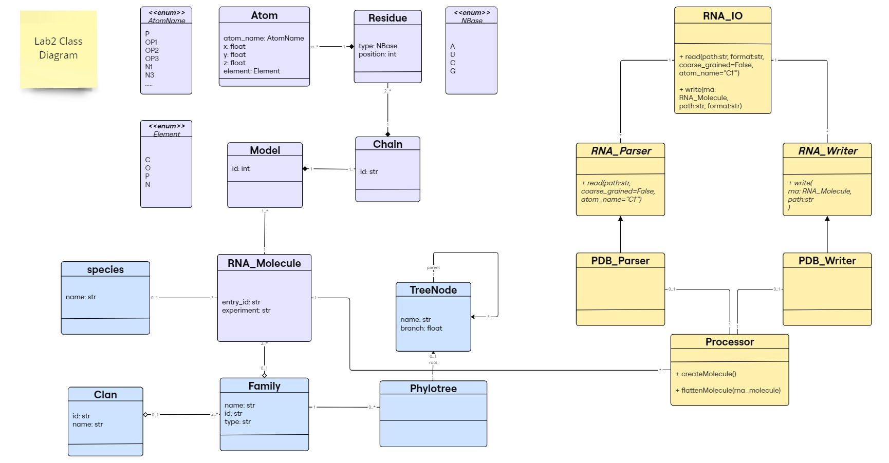
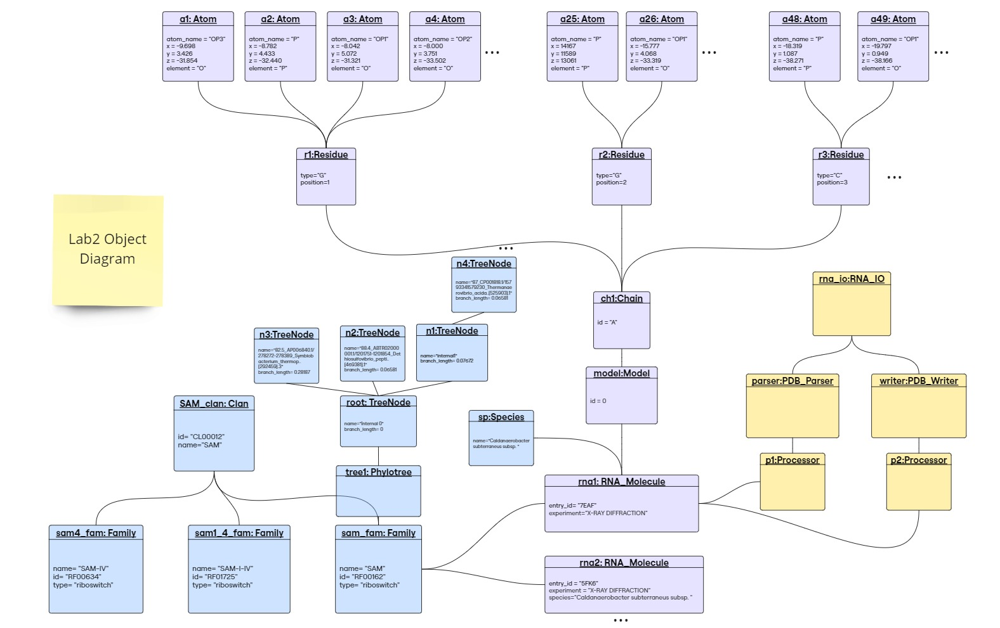

# Lab 2 Report

## Table of contents

- [Lab 2 Report](#lab-2-report)
  - [Table of contents](#table-of-contents)
  - [Class Diagram](#class-diagram)
  - [Object Diagram](#object-diagram)
  - [Implementation](#implementation)

Demo test on colab:   
 

https://github.com/rna-oop/2425-m1-geniomhe-group-6/tree/main/lab2/src

## Class Diagram

<figcaption align='center'>Class Diagram</figcaption>

As a minor enhancement to the previous lab design, we added `Species` entity to represent a class Species that is associated with `RNA_Molecule`. Instead of using attribute `species` in `RNA_Molecule` class as string type, it is now of `Species` type. An `RNA_Molecule` can have 1 `Species` or none (e.g., if it is synthetic). A `Species` can have many `RNA_Molecule` instances.

For the purpose of this lab (reading/writing to a file), new classes have been introduced in yellow in this diagram: 

1. `RNA_IO` **(User Interface for I/O Operations)**
    - Serves as the interface for reading and writing RNA sequence files.
    - Provides two methods:
        - `read(path, format, coarse_grained=False, atom_name=None)` → `RNA_Molecule`
            - Parses a file and returns an RNA_Molecule instance.
            - Optional parameters:
                - `coarse_grained`: If True, extracts only a subset of atoms for a simplified representation.
                - `atom_name`: Allows specifying a particular atom type to extract.
        - `write(rna_molecule, file_path, format)`
            - Writes an `RNA_Molecule` instance to a file.
    - Handles multiple file formats by relying on specialized `parsers` and `writers` for format-specific processing → can have many parsers and writers.

2. **Parsing** 
    - `RNA_Parser` (Abstract Class)
        - Defines the abstract method `read()`, enforcing child classes to implement format-specific parsing.
    - `PDB_Parser` (Concrete Class)
        - Implements `read()`, processing PDB files to create an RNA_Molecule instance.
  
3. **Writing**
    -  `RNA_Writer` (Abstract Class)
       - Defines the abstract method `write()`, ensuring all writers implement format-specific writing.
    - `PDB_Writer` (Concrete Class)
        - Implements `write()`, converting an RNA_Molecule instance into a PDB file.

4. `Processor` **(RNA Structure Representation Handler)**
    - An intermediary between parsers/writers and RNA_Molecule.
    - Converts parsed content into an RNA_Molecule instance.
    - Flattens an RNA_Molecule into a list of atoms for writing.
    - Associations:
        - `PDB_Parser` uses a `Processor` to construct `RNA_Molecule`.
        - `PDB_Writer` uses a `Processor` to extract relevant data for writing.
        - An `RNA_Molecule` can be associated with multiple `Processor` instances.
        - A `Processor` can belong to at most one `parser` or one `writer` (0..1 relationship). 

5. **Design Choice**
    - Decoupling:
        - RNA_IO provides a simple interface for users.
        - Parsers and Writers handle format-specific operations.
        - Processor ensures proper RNA representation.
    - Extensibility:
        - New formats (e.g., FASTA) can be supported by adding corresponding RNA_Parser and RNA_Writer subclasses.

## Object Diagram

<figcaption align='center'>Object Diagram</figcaption>

## Implementation
