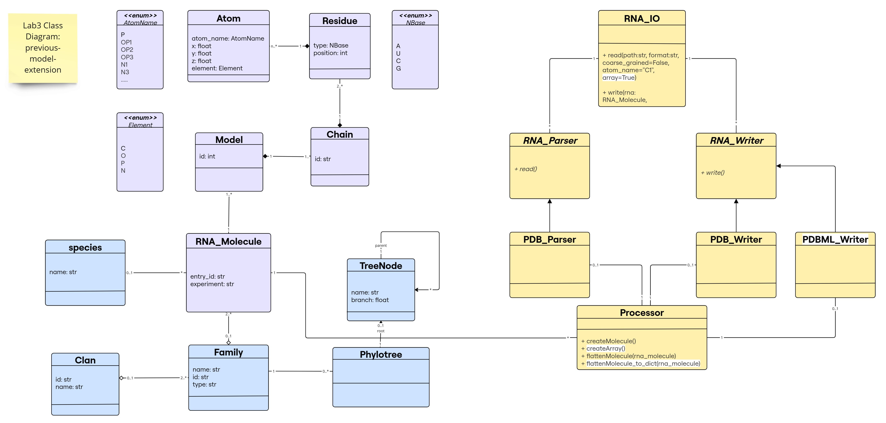
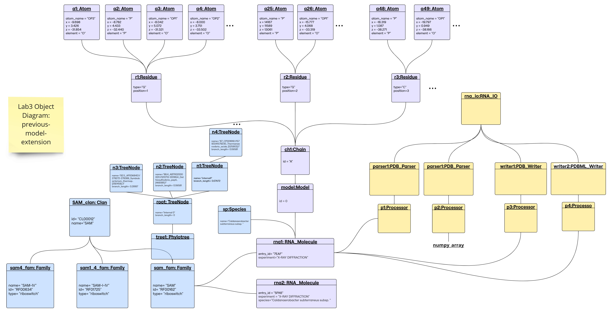
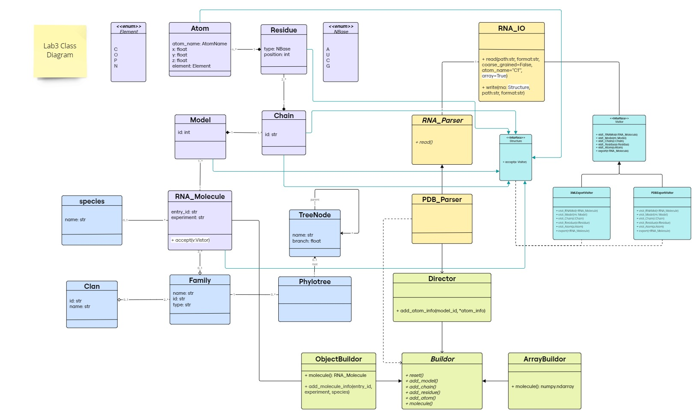
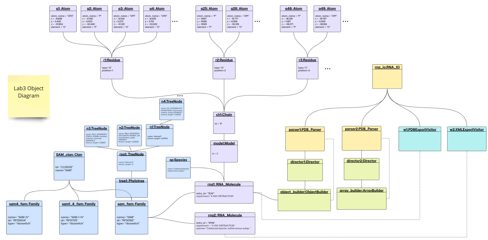
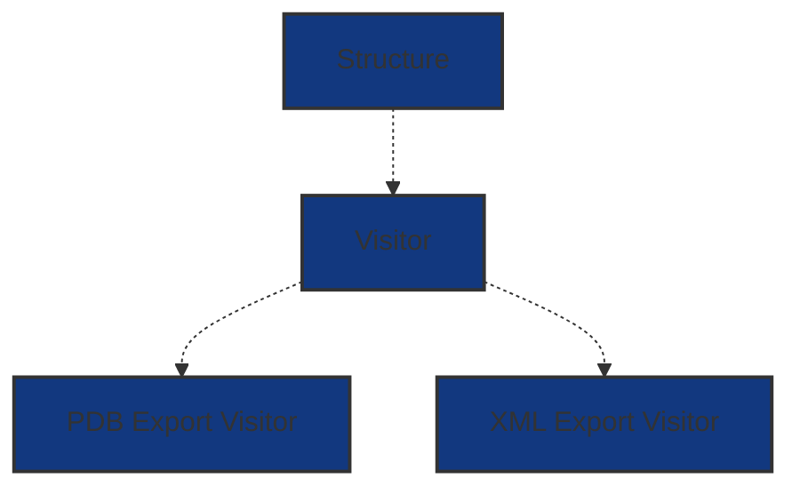

# Lab 3 Report

## Table of contents

- [Lab 3 Report](#lab-3-report)
  - [Table of contents](#table-of-contents)
  - [First Implementation](#first-implementation)
    - [Class Diagram for the Previous-Model-Extension](#class-diagram-for-the-previous-model-extension)
    - [Object Diagram for the Previous-Model-Extension](#object-diagram-for-the-previous-model-extension)
    - [1. Parser returns a numpy array](#1-parser-returns-a-numpy-array)
    - [2. Writing Structures into PDML/XML format](#2-writing-structures-into-pdmlxml-format)
  - [Main Implementation using Design Patterns](#main-implementation-using-design-patterns)
    - [Demo](#demo)
    - [Library Structure](#library-structure)
    - [Class Diagram](#class-diagram)
    - [Object Diagram](#object-diagram)
    - [1. Builder Design Pattern](#1-builder-design-pattern)
      - [iii. ObjectBuilder class](#iii-objectbuilder-class)
      - [iv. ArrayBuilder class](#iv-arraybuilder-class)
    - [2. Visitor design pattern](#2-visitor-design-pattern)
      - [i. Visitor interface](#i-visitor-interface)
      - [ii. PDBExportVisitor class](#ii-pdbexportvisitor-class)
      - [iii. XMLExportVisitor class](#iii-xmlexportvisitor-class)
      - [iv. Structure interface](#iv-structure-interface)
  - [Advantages and Disadvantages](#advantages-and-disadvantages)
    - [For the Builder Design Pattern](#for-the-builder-design-pattern)
    - [For the Visitor Design Pattern](#for-the-visitor-design-pattern)

## First Implementation

**This implementation is in the branch `previous-model-extension `.**  

[](https://github.com/rna-oop/2425-m1-geniomhe-group-6/blob/previous-model-extension/lab3/)


In this lab, we extended our previous model to include the following functionalities:
- The parser returns a numpy array representation of the molecule.
- Writing structures into PDML/XML format.

First, we kept our previous model and extended it with the minimal changes possible without using the design patterns. 

### Class Diagram for the Previous-Model-Extension 



The new changes are highlighted in white; note that `flattenMolecule_to_dict()` is a new method to provide an extra utility to the Processor class, not mandatory for the implementation (e.g., some libraries like numpy, pandas, etc. provide similar functionalities that transforms their main objects to different types of data structures).

### Object Diagram for the Previous-Model-Extension



### 1. Parser returns a numpy array

For this, we added a function in the `Processor` class called: `createArray()` that returns the required numpy array representation of an `RNA Molecule` that can have multiple models. 

Note: In our previous implementation, the parser will store the atom information in a list `atoms` inside the `Processor` class.

**createArray()** in `Processor` class:
- Returns a numpy array representation of the molecule
- Dimension: `(number of models, max_residues_no, max_atoms_per_residue_no, 3)` 
- Stores the x,y,z coordinates of each atom.
- Implementation notes:
  - To find the number of models we checked the model_id of the last atom in the atoms list. 
  - We had to loop through the list of atoms to find the maximum number of residues among all models and the maximum number of atoms per residue.
  - Considering that the same atom in a residue can have different coordinates (alternate locations), we stored the coordinates of the atom that has the highest occupancy.
  - The array is filled with nan values where there is no atom information.

**read() in `PDB_Parser` class:**
We added a boolean argument `array` to the `read()` function and set it to `True` by default. If the argument is `True`, the function will return the numpy array representation of the molecule, otherwise it will create the molecule object as before. We did not change anything in the `read()` function, we just added the following at the end:

```python
if array:
    return processor.createArray()
else:         
    return processor.createMolecule() 
```

**Code Usage**
An example can be found in the notebook [reading.ipynb](https://github.com/rna-oop/2425-m1-geniomhe-group-6/blob/previous-model-extension/lab3/demo/reading.ipynb) from the other branch.
[](https://github.com/rna-oop/2425-m1-geniomhe-group-6/blob/previous-model-extension/lab3/demo/reading.ipynb)

We read a molecule that contains 1 model and another molecule that contains multiple models, and showed the resulting arrays. 
A brief example:

```python
rna_io=RNA_IO()

pdb_path_test=pathify_pdb("7eaf")

mol=rna_io.read(pdb_path_test, "PDB")

print(mol.shape)
print(mol[0, -1, 0, :])
```

The output: 
```
(1, 94, 24, 3)
[-10.06    7.177 -49.234]
```

### 2. Writing Structures into PDML/XML format

**File format description:**

An PDBML file is an XML file that contains protein/nucleic acid structure information within an _xml format_. This is an efficient data storing format is widely used in databases and software tools to store and exchange data files in a structured manner. It was introduced to PDBe as the "PDBML" format by Westbrook et al. in a 2005 in a paper published in _Bioinformatics_ entitled "PDBML: the representation of archival macromolecular structure data in XML"[^1].

In python, writing and handling xml files is done without the use of libraries liek `xml`.  
Starting off by exploring this file (example used is 7eaf.xml taken from pdb), we notice the following structure

```xml
<PDBx:datablock xmlns:PDBx="http://pdbml.pdb.org/schema/pdbx-v50.xsd" xmlns:xsi="http://www.w3.org/2001/XMLSchema-instance" datablockName="7EAF" xsi:schemaLocation="http://pdbml.pdb.org/schema/pdbx-v50.xsd pdbx-v50.xsd">
  ...
</PDBx:datablock>
```

with all these tags included in the file:

```bash
grep -e '^   <PDBx:' 7eaf.xml #to retrive the list
```

- `<PDBx:atom_siteCategory>`
- `<PDBx:atom_site_anisotropCategory>`
- `<PDBx:atom_sitesCategory>`
- `<PDBx:atom_typeCategory>`
- `<PDBx:audit_authorCategory>`
- `<PDBx:audit_conformCategory>`
- `<PDBx:cellCategory>`
- `<PDBx:chem_compCategory>`
- `<PDBx:chem_comp_atomCategory>`
- `<PDBx:chem_comp_bondCategory>`
- `<PDBx:citationCategory>`
- `<PDBx:citation_authorCategory>`
- `<PDBx:database_2Category>`
- `<PDBx:diffrnCategory>`
- `<PDBx:diffrn_detectorCategory>`
- `<PDBx:diffrn_radiationCategory>`
- `<PDBx:diffrn_radiation_wavelengthCategory>`
- `<PDBx:diffrn_sourceCategory>`
- `<PDBx:entityCategory>`
- `<PDBx:entity_polyCategory>`
- `<PDBx:entity_poly_seqCategory>`
- `<PDBx:entryCategory>`
- `<PDBx:exptlCategory>`
- `<PDBx:exptl_crystalCategory>`
- `<PDBx:exptl_crystal_growCategory>`
- `<PDBx:ndb_struct_conf_naCategory>`
- `<PDBx:ndb_struct_na_base_pairCategory>`
- `<PDBx:ndb_struct_na_base_pair_stepCategory>`
- `<PDBx:pdbx_audit_revision_categoryCategory>`
- `<PDBx:pdbx_audit_revision_detailsCategory>`
- `<PDBx:pdbx_audit_revision_groupCategory>`
- `<PDBx:pdbx_audit_revision_historyCategory>`
- `<PDBx:pdbx_audit_revision_itemCategory>`
- `<PDBx:pdbx_audit_supportCategory>`
- `<PDBx:pdbx_database_statusCategory>`
- `<PDBx:pdbx_entity_nonpolyCategory>`
- `<PDBx:pdbx_entity_src_synCategory>`
- `<PDBx:pdbx_entry_detailsCategory>`
- `<PDBx:pdbx_initial_refinement_modelCategory>`
- `<PDBx:pdbx_nonpoly_schemeCategory>`
- `<PDBx:pdbx_poly_seq_schemeCategory>`
- `<PDBx:pdbx_refine_tlsCategory>`
- `<PDBx:pdbx_refine_tls_groupCategory>`
- `<PDBx:pdbx_struct_assemblyCategory>`
- `<PDBx:pdbx_struct_assembly_auth_evidenceCategory>`
- `<PDBx:pdbx_struct_assembly_genCategory>`
- `<PDBx:pdbx_struct_assembly_propCategory>`
- `<PDBx:pdbx_struct_conn_angleCategory>`
- `<PDBx:pdbx_struct_oper_listCategory>`
- `<PDBx:pdbx_struct_special_symmetryCategory>`
- `<PDBx:pdbx_validate_close_contactCategory>`
- `<PDBx:pdbx_validate_rmsd_bondCategory>`
- `<PDBx:refineCategory>`
- `<PDBx:refine_histCategory>`
- `<PDBx:refine_ls_restrCategory>`
- `<PDBx:refine_ls_shellCategory>`
- `<PDBx:reflnsCategory>`
- `<PDBx:reflns_shellCategory>`
- `<PDBx:softwareCategory>`
- `<PDBx:space_groupCategory>`
- `<PDBx:space_group_symopCategory>`
- `<PDBx:structCategory>`
- `<PDBx:struct_asymCategory>`
- `<PDBx:struct_connCategory>`
- `<PDBx:struct_conn_typeCategory>`
- `<PDBx:struct_keywordsCategory>`
- `<PDBx:struct_refCategory>`
- `<PDBx:struct_ref_seqCategory>`
- `<PDBx:symmetryCategory>`

[^1]:PDBML: the representation of archival macromolecular structure data in XML.
Westbrook J, Ito N, Nakamura H, Henrick K, Berman HM.
Bioinformatics, 2005, 21(7):988-992. PubMed:15509603 full text

The `<PDBx:atom_siteCategory>` tag contains all the information about the atoms in the structure, including all the hierarchical information model > chain > residue > atom. Thus the structure is solely defined by a list of atoms, in this format each will be represented by a tag `<PDBx:atom_site>`. 

```xml
<PDBx:datablock xmlns:PDBx="http://pdbml.pdb.org/schema/pdbx-v50.xsd" xmlns:xsi="http://www.w3.org/2001/XMLSchema-instance" datablockName="7EAF" xsi:schemaLocation="http://pdbml.pdb.org/schema/pdbx-v50.xsd pdbx-v50.xsd">
  <PDBx:atom_siteCategory>
    <PDBx:atom_site id="1">
    ...
    </PDBx:atom_site>
    <PDBx:atom_site id="2">
    ...
  </PDBx:atom_siteCategory>
</PDBx:datablock>
```

> [!IMPORTANT]
> The atom_siteCategory tag is the only category that reflects the information that we're capturing in this library, whether thorugh the RNA_Molecule object or the numpy array representation of it. This is the only category that will be included in the xml file. Others include information about bonds, symmetry, experimental setting and other metadata that is not captured in our object.

This is how the hierarchy leading to an atom representation is portrayed in the `.xml` file.

```
PDBx:datablock
├── datablockName
├── xsi:schemaLocation
└── PDBx:atom_siteCategory
    └── PDBx:atom_site
        ├── id
        ├── PDBx:B_iso_or_equiv
        ├── PDBx:Cartn_x
        ├── PDBx:Cartn_y
        ├── PDBx:Cartn_z
        ├── PDBx:auth_asym_id
        ├── PDBx:auth_atom_id
        ├── PDBx:auth_comp_id
        ├── PDBx:auth_seq_id
        ├── PDBx:group_PDB
        ├── PDBx:label_alt_id
        ├── PDBx:label_asym_id
        ├── PDBx:label_atom_id
        ├── PDBx:label_comp_id
        ├── PDBx:label_entity_id
        ├── PDBx:label_seq_id
        ├── PDBx:occupancy
        ├── PDBx:pdbx_PDB_model_num
        └── PDBx:type_symbol
```


Notice a slight difference between the representation of an atom with $occupancy=1$ and an atom with $occupancy<1$ (having an altrnate location). The difference is the presence of the `label_alt_id` tag. This will be taken care of while writing the file. This being said, each alternative location of an atom is cosidered a different atom in the file (with `PDBx:atom_site id` being $+1$ the id of the previous alternate location).

<table>
  <tr>
    <th>Atom with no alternative location</th>
    <th>Atom with alternative location</th>
  </tr>
  <tr>
    <td>
      <pre><code>&lt;PDBx:atom_site id="1"&gt;
  &lt;PDBx:B_iso_or_equiv&gt;110.87&lt;/PDBx:B_iso_or_equiv&gt;
  &lt;PDBx:Cartn_x&gt;-9.698&lt;/PDBx:Cartn_x&gt;
  &lt;PDBx:Cartn_y&gt;3.426&lt;/PDBx:Cartn_y&gt;
  &lt;PDBx:Cartn_z&gt;-31.854&lt;/PDBx:Cartn_z&gt;
  &lt;PDBx:auth_asym_id&gt;A&lt;/PDBx:auth_asym_id&gt;
  &lt;PDBx:auth_atom_id&gt;OP3&lt;/PDBx:auth_atom_id&gt;
  &lt;PDBx:auth_comp_id&gt;G&lt;/PDBx:auth_comp_id&gt;
  &lt;PDBx:auth_seq_id&gt;1&lt;/PDBx:auth_seq_id&gt;
  &lt;PDBx:group_PDB&gt;ATOM&lt;/PDBx:group_PDB&gt;
  &lt;PDBx:label_alt_id xsi:nil="true"/&gt;
  &lt;PDBx:label_asym_id&gt;A&lt;/PDBx:label_asym_id&gt;
  &lt;PDBx:label_atom_id&gt;OP3&lt;/PDBx:label_atom_id&gt;
  &lt;PDBx:label_comp_id&gt;G&lt;/PDBx:label_comp_id&gt;
  &lt;PDBx:label_entity_id&gt;1&lt;/PDBx:label_entity_id&gt;
  &lt;PDBx:label_seq_id&gt;1&lt;/PDBx:label_seq_id&gt;
  &lt;PDBx:occupancy&gt;1.0&lt;/PDBx:occupancy&gt;
  &lt;PDBx:pdbx_PDB_model_num&gt;1&lt;/PDBx:pdbx_PDB_model_num&gt;
  &lt;PDBx:type_symbol&gt;O&lt;/PDBx:type_symbol&gt;
&lt;/PDBx:atom_site&gt;
</code></pre>
    </td>
    <td>
      <pre><code>&lt;PDBx:atom_site id="170"&gt;
  &lt;PDBx:B_iso_or_equiv&gt;66.5&lt;/PDBx:B_iso_or_equiv&gt;
  &lt;PDBx:Cartn_x&gt;-14.543&lt;/PDBx:Cartn_x&gt;
  &lt;PDBx:Cartn_y&gt;-18.821&lt;/PDBx:Cartn_y&gt;
  &lt;PDBx:Cartn_z&gt;-25.673&lt;/PDBx:Cartn_z&gt;
  &lt;PDBx:auth_asym_id&gt;A&lt;/PDBx:auth_asym_id&gt;
  &lt;PDBx:auth_atom_id&gt;P&lt;/PDBx:auth_atom_id&gt;
  &lt;PDBx:auth_comp_id&gt;A&lt;/PDBx:auth_comp_id&gt;
  &lt;PDBx:auth_seq_id&gt;9&lt;/PDBx:auth_seq_id&gt;
  &lt;PDBx:group_PDB&gt;ATOM&lt;/PDBx:group_PDB&gt;
  &lt;PDBx:label_alt_id&gt;A&lt;/PDBx:label_alt_id&gt;
  &lt;PDBx:label_asym_id&gt;A&lt;/PDBx:label_asym_id&gt;
  &lt;PDBx:label_atom_id&gt;P&lt;/PDBx:label_atom_id&gt;
  &lt;PDBx:label_comp_id&gt;A&lt;/PDBx:label_comp_id&gt;
  &lt;PDBx:label_entity_id&gt;1&lt;/PDBx:label_entity_id&gt;
  &lt;PDBx:label_seq_id&gt;9&lt;/PDBx:label_seq_id&gt;
  &lt;PDBx:occupancy&gt;0.44&lt;/PDBx:occupancy&gt;
  &lt;PDBx:pdbx_PDB_model_num&gt;1&lt;/PDBx:pdbx_PDB_model_num&gt;
  &lt;PDBx:type_symbol&gt;P&lt;/PDBx:type_symbol&gt;
&lt;/PDBx:atom_site&gt;
</code></pre>
    </td>
  </tr>
</table>

_in this example id 171 is alt location B of the same atom in 170, and shows different occupancy_

**Implementation: object to xml**

Thanks to the hierarchical class design of the molecule object, we're able to retrieve all information needed describing an atom, for each atom in the molecule.

In porcessor, this method `flattenMolecule_to_dict` takes an object and returns a list of atom dictionaries, where the keys of each dictionary are named exactly as the tags in the xml file. 

> [!NOTE] 
> It practically has the same behavior as `flattenMolecule` but returns a list of dictionaries instead of a list of atom info and objects (allowing diverse output formats).

This way, we can easily create the xml file by iterating over the list of atoms and creating the corresponding tags.

```python
    def flattenMolecule_to_dict(self,rna_molecule:RNA_Molecule):
        '''
        rna_molecule: RNA_Molecule object -> RNA molecule to be flattened -> list of atom dictionaries
        '''
        atoms_list = []

        for model_num,_ in enumerate(rna_molecule.get_models()):  #--looping through all models 
            model=rna_molecule.get_models()[_] # --model object from dict key
            
            for chain in model.get_chains().values(): #--looping through all chains
                for residue in chain.get_residues().values(): #--looping through all residues  
                    for atom_key, atom in residue.get_atoms().items(): #--looping through all atoms
                        atom_id, alt_id = atom_key  # unpacking atom key (alt_id is '' if no alt location)
                        # --keys defined identically to pdbml format, values extracted directly from atom object
                        atom_data = {
                            "atom_id": str(len(atoms_list) + 1),  # Assign a sequential ID
                            "B": str(atom.temp_factor),
                            "x": str(atom.x),
                            "y": str(atom.y),
                            "z": str(atom.z),
                            "chain_id": chain.id,
                            "atom_id": atom_id,
                            "residue_type": residue.type.name,
                            "residue_pos": str(residue.position),
                            "alt_id": None if alt_id == "" else alt_id,
                            "occupancy": str(atom.occupancy),
                            "model_no": model_num+1,
                            "atom_element": atom.element.name
                        }
                        atoms_list.append(atom_data)
        return atoms_list
```

To convert to PDBML, xml formatting private functions have been implemented in `PDBML_Writer` submodule. 

```python
# --helper methods
    def _wrap_str_to_xml(self,s,name='pdbml_output.xml'):
        with open(name, "w") as f:
            f.write(s)

    def _format_atom_info(self, atoms_list,entry_id):
        '''
        formats a list of atoms dicts into XML format
        '''
        s='''<?xml version="1.0" encoding="UTF-8" ?>
<PDBx:datablock datablockName="'''+entry_id+'''"
   xmlns:PDBx="http://pdbml.pdb.org/schema/pdbx-v50.xsd"
   xmlns:xsi="http://www.w3.org/2001/XMLSchema-instance"
   xsi:schemaLocation="http://pdbml.pdb.org/schema/pdbx-v50.xsd pdbx-v50.xsd">'''
        s+='\n\t<PDBx:atom_siteCategory>\n'
        for atom in atoms_list:
            s+='\t\t<PDBx:atom_site id="'+atom["atom_id"]+'">\n'
            s+='\t\t\t<PDBx:B_iso_or_equiv>'+str(atom['B'])+'</PDBx:B_iso_or_equiv>\n'
            s+='\t\t\t<PDBx:Cartn_x>'+str(atom['x'])+'</PDBx:Cartn_x>\n'
            s+='\t\t\t<PDBx:Cartn_y>'+str(atom['y'])+'</PDBx:Cartn_y>\n'
            s+='\t\t\t<PDBx:Cartn_z>'+str(atom['z'])+'</PDBx:Cartn_z>\n'
            s+='\t\t\t<PDBx:auth_asym_id>'+atom['chain_id']+'</PDBx:auth_asym_id>\n'
            s+='\t\t\t<PDBx:auth_atom_id>'+atom['atom_id']+'</PDBx:auth_atom_id>\n'
            s+='\t\t\t<PDBx:auth_comp_id>'+atom['residue_type']+'</PDBx:auth_comp_id>\n'
            s+='\t\t\t<PDBx:auth_seq_id>'+str(atom['residue_pos'])+'</PDBx:auth_seq_id>\n'
            s+='\t\t\t<PDBx:group_PDB>ATOM</PDBx:group_PDB>\n'
            if atom['alt_id'] is not None:
                s+='\t\t\t<PDBx:label_alt_id xsi:nil="true" />\n'
            else:
                atom['alt_id']='A'
            s+='\t\t\t<PDBx:label_asym_id>'+atom['alt_id']+'</PDBx:label_asym_id>\n'
            s+='\t\t\t<PDBx:label_atom_id>'+atom['atom_id']+'</PDBx:label_atom_id>\n'
            s+='\t\t\t<PDBx:label_comp_id>'+atom['residue_type']+'</PDBx:label_comp_id>\n'
            s+='\t\t\t<PDBx:label_entity_id>1</PDBx:label_entity_id>\n'
            s+='\t\t\t<PDBx:label_seq_id>'+str(atom['residue_pos'])+'</PDBx:label_seq_id>\n'
            s+='\t\t\t<PDBx:occupancy>'+str(atom['occupancy'])+'</PDBx:occupancy>\n'
            s+='\t\t\t<PDBx:pdbx_PDB_model_num>'+str(atom['model_no'])+'</PDBx:pdbx_PDB_model_num>\n'
            s+='\t\t\t<PDBx:type_symbol>'+atom['atom_element']+'</PDBx:type_symbol>\n'
            s+='\t\t</PDBx:atom_site>\n'
        s+='\t</PDBx:atom_siteCategory>\n'
        s+='</PDBx:datablock>'
        return s
```

**Code usage:**

```python
mol: RNA_Molecule #suppose a declared instance of RNA_Molecule

rna_io=RNA_IO()
rna_io.write(mol, "7eaf_object.xml",'PDBML')
```

_example output:_

```bash
cat 7eaf_object.xml
```

```xml
<?xml version="1.0" encoding="UTF-8" ?>
<PDBx:datablock datablockName="7EAF"
   xmlns:PDBx="http://pdbml.pdb.org/schema/pdbx-v50.xsd"
   xmlns:xsi="http://www.w3.org/2001/XMLSchema-instance"
   xsi:schemaLocation="http://pdbml.pdb.org/schema/pdbx-v50.xsd pdbx-v50.xsd">
	<PDBx:atom_siteCategory>
		<PDBx:atom_site id="OP3">
			<PDBx:B_iso_or_equiv>110.87</PDBx:B_iso_or_equiv>
			<PDBx:Cartn_x>-9.698</PDBx:Cartn_x>
			<PDBx:Cartn_y>3.426</PDBx:Cartn_y>
			<PDBx:Cartn_z>-31.854</PDBx:Cartn_z>
			<PDBx:auth_asym_id>A</PDBx:auth_asym_id>
			<PDBx:auth_atom_id>OP3</PDBx:auth_atom_id>
			<PDBx:auth_comp_id>G</PDBx:auth_comp_id>
			<PDBx:auth_seq_id>1</PDBx:auth_seq_id>
			<PDBx:group_PDB>ATOM</PDBx:group_PDB>
			<PDBx:label_asym_id>A</PDBx:label_asym_id>
			<PDBx:label_atom_id>OP3</PDBx:label_atom_id>
			<PDBx:label_comp_id>G</PDBx:label_comp_id>
			<PDBx:label_entity_id>1</PDBx:label_entity_id>
			<PDBx:label_seq_id>1</PDBx:label_seq_id>
			<PDBx:occupancy>1.0</PDBx:occupancy>
			<PDBx:pdbx_PDB_model_num>1</PDBx:pdbx_PDB_model_num>
			<PDBx:type_symbol>O</PDBx:type_symbol>
		</PDBx:atom_site>
...
```

a minor addition to `RNA_IO` class was made to include the option of writing in PDBML format. 

```python
class RNA_IO:
    def __init__(self):
        ...
        self.__writers={"PDB": PDB_Writer(),'PDBML': PDBML_Writer(),'XML': PDBML_Writer()}
```


**Parallelism with PDB_Writer**

- [x] user interface:
```python
rna_io=RNA_IO()
mol: RNA_Molecule 

rna_io.write(mol, "7eaf_object.xml",'PDBML') #also works by specifying XML
rna_io.write(mol, "7eaf_object.pdb",'PDB')
```


| PDB_Writer | PDBML_Writer |
|------------|--------------|
| inherits RNA_Writer abstract class | inherits RNA_Writer abstract class |
| `write(molecule: RNA_Molecule, file_path: str)` | `write(molecule: RNA_Molecule, file_path: str)` |
| takes an RNA_Molecule object | takes an RNA_Molecule object |
| uses processor instance to get the atom information | uses processor instance to get the atom information |
| uses processor.flattenMolecule() | uses processor.flattenMolecule_to_dict() |
| has format specific private method `_format_atom_info()` and `_format_molecule_info` | has format specific private method `_format_atom_info()` and `_wrap_str_to_xml()` |
| writes the pdb file | writes the pdbml file |


## Main Implementation using Design Patterns

The implementation of the classes is available in the [src](https://github.com/rna-oop/2425-m1-geniomhe-group-6/tree/main/lab3/src) directory in the `main` branch. 

### Demo

For a demonstration of the Builder and Visitor Design Patterns, you can check the notebook [reading-writing.ipynb](./demo/reading.ipynb)

[](./demo/reading_writing.ipynb)


### Library Structure

In this lab, we added `Processing` module that contains the classes of the `Builder Design Pattern` and `visitors_writers` module that contains the classes of the `Visitor Design Pattern`inside `IO` module.

The classes are organized in modules and submodules as follows:

```text
.
├── Families
│   ├── __init__.py
│   ├── clan.py
│   ├── family.py
│   ├── species.py
│   └── tree.py
├── IO
│   ├── RNA_IO.py
│   ├── __init__.py
│   ├── parsers
│   │   ├── PDB_Parser.py
│   │   ├── RNA_Parser.py
│   │   ├── __init__.py
│   └── visitor_writers
│       ├── __init__.py
│       ├── pdb_visitor.py
│       ├── visitor.py
│       └── xml_visitor.py
├── Processing
│   ├── ArrayBuilder.py
│   ├── Builder.py
│   ├── Director.py
│   ├── ObjectBuilder.py
│   └── __init__.py
├── Structure
│   ├── Atom.py
│   ├── Chain.py
│   ├── Model.py
│   ├── RNA_Molecule.py
│   ├── Residue.py
│   └── __init__.py
└── utils.py

10 directories, 21 files

```


### Class Diagram



The changes are following this color scheme:
- ***Builder Design Pattern***: light green <span style="background-color:#EBF5B3; display:inline-block; width:10px; height:10px;"></span> 
- ***Visitor Design Pattern***: light blue <span style="background-color:#B8F0F2; display:inline-block; width:10px; height:10px;"></span> (classes and inheritance link for our predefined RNA_Molecule class)
- *methods added to the existing classes*: highlighted in white <span style="background-color:#FFFFFF; display:inline-block; width:10px; height:10px;"></span> 

### Object Diagram



### 1. Builder Design Pattern

In this lab, we used the `Builder` design pattern to separate the construction of the RNA molecule object from its representation.

**Modifications done to `PDB Parser`:**

- Added a new argument `array=True` to the `read()` function to return the numpy array representation of the molecule.
  
- Instead of using the `Processor` class to create the molecule object when reading the PDB file, we used the `Director` class and the corresponding `Builder` class. 
   ```python
    director = Director()

    if array == True:
        builder = ArrayBuilder()
    else:
        builder = ObjectBuilder()

    director.builder = builder

    ```

- Instead of `processor.molecule_info()` that used to store the molecule info (id, experiment, species), we added a new method in the `ObjectBuilder` class called `add_molecule_info()` that adds the molecule info to the molecule object, and we used it in the `PDB_Parser`'s `read() function` as follows:
    ```python
    if array==False:
            builder.add_molecule_info(*molecule_info)
    ```

- Instead of `processor.atom_info` that used to store the atom info, we now use `director.add_atom_info(model_id, *atom_info)` which serves as a recipe to build the corresponding molecule.

- Finally, instead of `processor.createMolecule()` that creates only an object, we return `builder.molecule` to get the built molecule that can be an object or a numpy array depending on the builder used.

#### i. Director class

- The `Director` class serves as a director for the `Builder` classes. 

- **Attributes:**
    - `__builder`: The builder object that will be used to build the object. Initialized to `None`.

- **Methods:**
    - @property `builder`: Returns the builder object.
    - @builder.setter `builder`: Sets the builder object after checking if it is an instance of the `Builder` class.
    - `add_atom_info`: serves as a common recipe on how to build the molecule for the different `Builder` classes:
        ```python
            def add_atom_info(self, model_id, *atom_info):
            atom_name, x, y, z, element, residue_name, residue_id, chain_id, altloc, occupancy, temp_factor, i_code, charge = atom_info
            self.builder.add_model(model_id)
            self.builder.add_chain(chain_id)
            self.builder.add_residue(residue_name, residue_id, i_code)
            self.builder.add_atom(atom_name, x, y, z, element, altloc, occupancy, temp_factor, charge)
        ```
        - The method takes the model_id and atom_info as arguments that are retrieved from the  `Parser` and calls the corresponding methods in the builder object in a specific order to add the model, chain, residue, and atom information.

#### ii. Builder class

- The `Builder` class is an interface, implemented as an abstract class with all its methods being abstract. 

- It defines the methods that the concrete `Builder` classes should implement.

```python

    @property
    @abstractmethod
    def molecule(self):
        pass
    
    @abstractmethod
    def add_atom(self):
        pass
    
    @abstractmethod
    def add_residue(self):
        pass
    
    @abstractmethod
    def add_chain(self):
        pass
    
    @abstractmethod
    def add_model(self):
        pass

    @abstractmethod
    def reset(self):
        pass
```
- The `molecule` method is a property that should return the built molecule object.
- The `reset` method is used to reset the builder object to its initial state.
- The other methods are used to add atom, residue, chain, and model information to the molecule object.

#### iii. ObjectBuilder class

- The `ObjectBuilder` class is a concrete builder class that implements the `Builder` interface.
- It is responsible for constructing the RNA molecule object.

- **Attributes:**
    - `__molecule`: The RNA molecule object that is being built.
    - other private attributes to keep track of the model, chain, and residue ids.
  
- **Methods:**

    - `reset`: Resets the builder object to its initial state:
        - The molecule object is set to an empty RNA molecule object.
        - The model, chain, and residue ids are set to 0.
  
    - `molecule`: @property, returns the built molecule object and resets the builder object.
- 
    - `add_model`: 
        - Creates a new model object with the given model_id and adds it to the molecule object.
        - Sets the model_id attribute to the given model_id.
  
    - `add_chain`: 
        - Retrieves the model object with the current model_id. 
        - Creates a new chain object with the given chain_id and adds it to the model object.
        - Sets the chain_id attribute to the given chain_id.
  
    - `add_residue`: 
        - Retrieves the chain object with the current chain_id from the model object with the current model_id.
        - Creates a new residue object with the given residue arguments and adds it to the chain object.
        - Sets the residue_id attribute to the residue_id of the added residue.
  
    - `add_atom`: 
        - Retrieves the residue object with the current residue_id from the chain object with the current chain_id from the model object with the current model_id.
        - Creates a new atom object with the given atom arguments and adds it to the residue object.  
  
    - `add_molecule_info`: 
        - Additional method specific for this builder.
        - Adds the entry_id, experiment, and species information to the molecule object.
  
#### iv. ArrayBuilder class

- The `ArrayBuilder` class is a concrete builder class that implements the `Builder` interface.

- It is responsible for constructing the numpy array representation of the RNA molecule object:
    - Dimension: `(number of models, max_residues_no, max_atoms_per_residue_no, 3)`
    - Stores the x,y,z coordinates of each atom.
    - Fills the array with nan values where there is no atom information.
  
- **Attributes:**
    - `__array`: A dictionary that stores the atom coordinates for each residue in the molecule.
    - `__model_id`: The current model id.
    - `__residue_id`: The current residue id.
    - `__prev_atom`: A list that stores the previous atom name and occupancy to handle alternate locations.

- **Methods:**

    - `reset`: Resets the builder object to its initial state:
        - The array dictionary is set to an empty dictionary.
        - The model_id and residue_id are set to 0.
        - The prev_atom list is set to empty string for atom_name and 0.0 for occupancy.
  
    - `add_model`: Sets the model_id attribute to the given model_id.
    - `add_chain`: Does nothing.
    - `add_residue`: Sets the residue_id attribute to the given residue_id and initializes the atom list for the residue.
    - `add_atom`: Adds the atom coordinates to the atom list of the current residue in the array dictionary.
        - Handles alternate locations by storing the atom with the highest occupancy.

    - `molecule`: @property, returns the numpy array representation of the molecule. 
        - Finds the maximum number of atoms per residue by taking the maximum length of the atom lists in the array dictionary.
        - Finds the maximum number of residues by taking the maximum residue_id from the keys of the array dictionary.
        - Creates a numpy array with the calculated dimensions and fills it with the atom coordinates.
        - Resets the builder object to its initial state.
        
    - Importance of the `dictionary`:
        - Since we cannot know the maximum dimensions of the numpy array in advance, we used a dictionary to store the atom coordinates for each residue. 
        - The keys are tuples of the form `(model_id, residue_id)` and the values are lists of atom coordinates.
        - This structure allows for easy retrieval and addition of atom coordinates for each residue.
        - The dictionary is cleared after constructing the numpy array.

### 2. Visitor design pattern

The visitor design pattern is implemented to be able to export an RNA object into various file formats: `PDB` and `PDBML/XML`. The aim of using this pattern is to perform this operation without adding this functionality in the `RNA_Molecule` class itself, but creates a new class that will be able to visit an RNA object and perform the export operation.

**Modifications done to previous implementation:**

As defined in the [lab2, The `PDB_Writer`](../lab2#pdb_writer-class) class was reposnible for generating the PDB file. The followed logic is to flatten an RNA object into primitive datatypes that will be used directly while writing the PDB file, a helper function was implemented in `processor` submodule.

In the current lab:  
- `processor` module is complelty deprecated, no more use of flattening in this case
- Another writer type is added in `RNA_IO` to account for the possibility of the user choosing `XML` or `PDBML` as a file format to output
- `Visitor` interface is created to extract the information needed and fix the format for writing the file, which will be doing that through different visit methods; takes the different hierarchical levels of the RNA object (Atom, Residue, Chain, Model and RNA_Molecule).

| PDB_Writer | PDBExportVisitor |
|------------|--------------|
| implements `RNA_Writer` interface to enforce a method | implements `Visitor` interface to enforce a method |
| uses `flatten_to_dict` method from `processor` submodule | uses visit methods: visit_Atom, visit_Residue, visit_Chain, visit_Model, visit_RNA_Molecule to extract the info in a file-format-specific format |
| `write` method: RNA_Molecule -> None (writes to file) |  `export` method: RNA_Molecule -> None (uses visit methods to write the file) |
| uses `RNA_IO` interface | uses `RNA_IO` interface |

Generally, we can see that this pattern resembles the previous implementation, but with a more structured way of extracting the information needed to write the file. It is thus split into different methods to allow formatting the information at different "structural" levels of the RNA object. Overall, the same user interface is maintained, and this is how to formally write the file:

```python
mol: RNA_Molecule #suppose a declared instance of RNA_Molecule
rna_io=RNA_IO()
rna_io.write(mol, "7eaf_object.xml",'PDBML')
```


**Slight intro and background explaining the design:**

The visitor design pattern is composed of the following elements:

| entities | type | description |
| --- | --- | --- |
| `Structure` | interface | defines the accept method that will be implemented by the concrete elements of the object structure (objects building RNA_Molecule) |
| `Visitor` | interface | enforce a visit method on all concrete visitors that implements it |
| `PDBExportVisitor` | class | implements `Visitor` and defines the visit method for each element of the object Structure (here only `RNA_Molecule`) $\leftarrow$ exports a PDB file |
| `XMLExportVisitor` | class | implements `Visitor` and defines the visit method for each element of the object Structure (here only `RNA_Molecule`) $\leftarrow$ exports a PDBML/XML file |


#### i. Visitor interface

The visitor interface is defined in the [`visitor`](./src/IO/visitor_writers/visitor.py) module and contains the following methods:
- `visit_Atom(atom: Atom)`: formats atom's information into a file-format-specific format (depending on the visitor)
- `visit_Residue(residue: Residue)`: formats residue's information 
- `visit_Chain(chain: Chain)`: formats chain's information
- `visit_Model(model: Model)`: formats model's information
- `visit_RNA_Molecule(rna: RNA_Molecule)`: formats RNA_Molecule's information
- `export(rna: RNA_Molecule)`: exports the RNA object into a file format by using the visit methods (encapsulated by `RNA_IO` to maintain the user interface)


```python
# visitor.py
class Visitor(ABC):
    @abstractmethod
    def visit_RNA_Molecule(self, rna: RNA_Molecule):
        pass
    @abstractmethod
    def visit_Model(self, model: Model):
        pass
    @abstractmethod
    def visit_Chain(self, chain: Chain):
        pass
    @abstractmethod
    def visit_Residue(self, residue: Residue):
        pass
    @abstractmethod
    def visit_Atom(self, atom: Atom):
        pass
    @abstractmethod
    def export(self, rna: RNA_Molecule):
        pass
```

There are 2 concrete visitors in this lab, found in submodules `pdb_visitor` and `xml_visitor`. Each of these classes implements the `Visitor` interface and defines all the abstract methods, to finally export the RNA object into a file format.

#### ii. PDBExportVisitor

```python 
# pdb_visitor.py
'''
PDBExportVisitor submodule:
---------------------------
contains the PDBExportVisitor class that implements the Visitor interface

- visit_Atom(a:Atom)-> list
- visit_Residue(r:Residue)-> list
- visit_Chain(c:Chain)-> string
- visit_Model(m:Model)-> string
- visit_RNA_Molecule(rna:RNA_Molecule)-> string
- export(rna:RNA_Molecule)-> None: writes the PDB file using previously defined visit methods
'''
```

Each visit returns either a list or string that follows the particular `PDB` format. _e.g., `visit_Atom` returns a list that contain atom information as strings, formatted as they are represented in a PDB file._.

#### iii. XMLExportVisitor

```python
# xml_visitor.py
'''
XMLExportVisitor submodule:
---------------------------
contains the XMLExportVisitor class that implements the Visitor interface

- visit_Atom(a:Atom)-> list
- visit_Residue(r:Residue)-> list
- visit_Chain(c:Chain)-> list
- visit_Model(m:Model)-> string
- visit_RNA_Molecule(rna:RNA_Molecule)-> string
- export(rna:RNA_Molecule)-> None: writes the XML file using previously defined visit methods
'''
```

As in PDBExportVisitor, each visit method returns a list or string that follows the particular `PDBML/XML` format, by this we mean the attribute expressed as tags, _e.g. an example of visit_Model(m) output is `<PDBx:pdbx_PDB_model_num>1</PDBx:pdbx_PDB_model_num>`_

#### iv. Structure interface

_this is the Component interface, as per the design pattern definition. Different ConcreteComponents classes implement this interface_  

In this lab, this interface is implemented within `Structure.Structure` submodule. It is parent of `Atom`, `Residue`, `Chain`, `Model` and `RNA_Molecule` classes, which are all the structural components of the RNA object. It defines the `accept` method that takes _any Visitor type object_ as an argument and enforces it on all classes that implement it.

nderneath the hood, the `accept` method, calls the `visit` method of the visitor object, passing itself as an argument. This is done to allow the visitor to access the information of the object it is visiting.

```python
class RNA_Molecule(Structure):
  ...
    def accept(self, visitor: Visitor):
        visitor.visit_RNA_Molecule(self)

class Model(Structure):
    ...
        def accept(self, visitor: Visitor):
            visitor.visit_Model(self)
...
```

> [!WARNING]
> By definition of the visitor pattern, there should be overloaded methods named `visit` but that take different type of argument (_e.g., `visit(a:Atom)` and `visit(r:Residue)`). However, since we are using python (no support for method overloading), we will be using different method names for each type of object (which is also the commnly used strategy when implementing the visitor pattern in python).



*any object that is of class type implementing Structure will accept any Visitor type, which will call the visit method of the specific visitor instanciated*


## Advantages and Disadvantages

### For the Builder Design Pattern

What we might consider as a disadvantage of the Builder Design Pattern over the previous implementation:
- The Builder Design Pattern adds complexity to the code by introducing additional classes and methods.
- The previous model just required a single additional method `createArray()` in the `Processor` class to return the numpy array representation of the molecule. 

But on the other hand, it has also introduced many advantages:
- Each representation has its own dedicated builder class, making the code cleaner and more maintainable, especially if more representations are needed in the future. 
- The Builder Pattern enables the direct construction of the required representation without unnecessary intermediate objects.
- It provides a single recipe for the construction, that is common to all representations, which ensures consistency in how different representations are generated, reducing redundancy and potential errors.
- It breaks the construction into smaller steps, making it easier to modify or extend the building process without affecting the entire system, allowing for greater flexibility and maintainability.
  
### For the Visitor Design Pattern


Advantages: Some of the _primary_ goals of a visitor pattern were actually met in the previous implementation (symbolized by ✅)._As previously discussed, there are equivalent notions have been found between this and the prior implementation (check [visitor pattern explanation](#2-visitor-design-pattern))._:

* [x] The Visitor Pattern allows you to separate the logic of traversing the molecular structure from the operations applied to it; instead of having the RNA_Molecule class handle both data representation and output formatting, the visitor can encapsulate format-specific logic keeping the RNA_Molecule class clean and focused on its main purpose (molecular structure representation). _previous implementation met this goal_
* [x] It allows support for other output formats (_e.g., csv, json_) to be added at any point in development without modifying the previous code (open-closed principle). _previous implementation met this goal_
* [ ] Formatting is split to account for different structural elements seperately, which can be seen as an advantage in terms of code readability and maintainability, but also as a disadvantage in terms of code complexity (described next).
* [ ] Ability to accept a visitor from any object of the structure, which can be seen as an advantage in terms of flexibility (portray the object in the way its represented in the file), however it's an encapsulated property that is generally not used in the current implementation, having the official writing interface handeled by `RNA_IO` class (takes directly an RNA object and a file format to write to).

Disadvantages:  
* Complex code: previous implementation handeled writing like the visitor pattern (in a seperate class from `RNA_Molecule`) but performed it in a more direct way by directly flattening a molecule object into a list of atoms and formatting it to a file.

