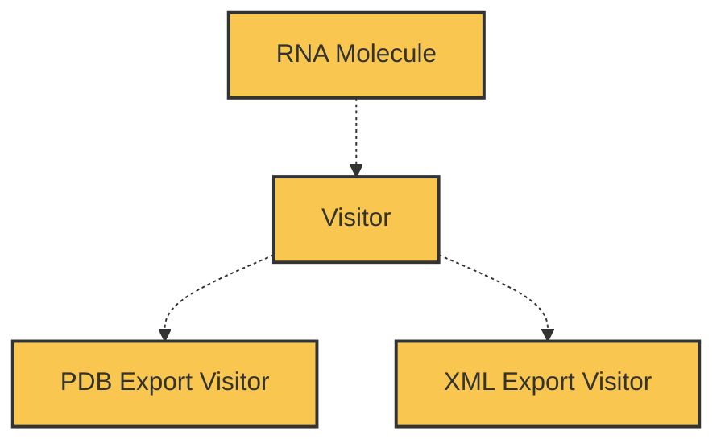

### 2. Visitor design pattern

The visitor design pattern aims to separate the algorithm from the object structure on which it operates. In this case we want to be able to operate on RNA to export it into various file formats: PDB and PDBML/XML. Our aim is to perform this withour adding a functionality to the `RNA_Molecule` class itself, but rather to create a new class that will be able to visit the RNA molecule and perform the export functionality.

**Modifications done to `PDB_Writer`**


As defined in the [lab2, The `PDB_Writer`](https://github.com/rna-oop/2425-m1-geniomhe-group-6/tree/main/lab2#pdb_writer-class) class was reposnible for generating the PDB file.

The same functionalities writing the file persists, however, the technicalities of handeling them are changed to account for class and method terminology and manipulation consistency with the way the _Visitor_ pattern in defined.

* The write method is mainly substituted now by a "visit" method, which is encapsulated within the RNA_Molecule class object, in a method called `accept` (detailed later, now highlighting differences)
* Instead of using Processor class to read the molecule info and _store_ them within a processor object's fields, Processor and PDB_Writer to Flatten an object is now a helper function in utils to allow access on the transformation Molecule -> list or Molecule -> dict (and PDB_Writer format methods are now _private_ helper functions within the pdb_visitor module since it's a PDB specific format). 

> [!WARNING]
The whole class `PDB_Writer` with its parent `RNA_Writer` is deprecated now in this lab, dragging down the other classes RNA_IO and Processor which were nestedly involved in the writing process. To the user, there is a slight change within the ui provided to write in order to accomodate with what the $Visitor$ design enforces

**Slight intro and background explaining the design:**

The visitor design pattern is composed of the following elements:

| entities | type | description |
| --- | --- | --- |
| `Structure` | interface | defines the accept method that will be implemented by the concrete elements of the object structure |
| `RNA_Molecule` | class | implements the `Structure` interface and defines the accept method that will call the visit method of the visitor, our class type defined throughout the project |
| `Visitor` | interface | enforce a visit method on all concrete visitors that implements it |
| `PDBExportVisitor` | class | implements `Visitor` and defines the visit method for each element of the object Structure (here only `RNA_Molecule`) $\leftarrow$ exports a PDB file |
| `XMLExportVisitor` | class | implements `Visitor` and defines the visit method for each element of the object Structure (here only `RNA_Molecule`) $\leftarrow$ exports a PDBML/XML file |

this design pattern is used in the following way:

```python
# rna_Molecule: RNA_Molecule

pdb_exporter = PDBExportVisitor()
rna_Molecule.accept(pdb_exporter)

xml_exporter = XMLExportVisitor()
rna_Molecule.accept(xml_exporter)
```

_Example output files are provided (generated from [`application.py`](./src/Processing/visitors/application.py)):_

* [7EAF_PDBified.pdb](./demo/7EAF_PDBified.pdb)
* [7EAF_PDBMLified.xml](./demo/7EAF_PDBML.xml)


#### i. Visitor interface

The visitor interface is defined in the `visitor` module and contains a single method, `visit_RNA_Molecule`, which will be implemented by the concrete visitors

```python
# visitor.py
class Visitor(ABC):
    @abstractmethod
    def visit_RNA_Molecule(self, rna: RNA_Molecule):
        pass
```

#### ii. Concrete visitors

There are 2 concrete visitors in this lab, found in submodules `pdb_visitor` and `xml_visitor`. Each of these classes implements the `Visitor` interface and defines the `visit_RNA_Molecule` method, which will perform the export operation.

* `PDBExportVisitor`
```python
# pdb_visitor.py
class PDBExportVisitor(Visitor):
    def visit_RNA_Molecule(self, rna: RNA_Molecule):
        # export the RNA molecule to a PDB file
        ...
```
this class has some helper methods in order to format the data in the PDB format, which are private methods( start with `_ and not part of the class) not meant to be accessed.
* `XMLExportVisitor`
```python
# xml_visitor.py
class XMLExportVisitor(Visitor):
    def visit_RNA_Molecule(self, rna: RNA_Molecule):
        # export the RNA molecule to a PDBML/XML file
        ...
```
Formatting into XML is done manually without the use of `xml` library.

Both classes use flattening functions provided in `utils` to convert the RNA_Molecule object into a list or a dictionary, which can then be used to generate the file (primitive data types to be used instead of objects, makes it more flexible to implement other similar visit methods for other types of objects).

#### iii. Element interface

In this implementation, this is the `Structure` interface, which is implemented by the `RNA_Molecule` module (because RNA_Molecule will implement it) and defines the `accept` method that takes _any Visitor_ as an argument and enforces it on ConcreteElement classes that implement it.

Underneath the hood, the `accept` method of the `RNA_Molecule` class will call the `visit` method of the visitor class, which will then perform the export operation.

```python
class RNA_Molecule(Structure):
    ...
    def accept(self, visitor: Visitor):
        visitor.visit_RNA_Molecule(self)
```

> [!NOTE]
> since python does not provide direct overloading, we need to define a method for each element of the object structure that the visitor will visit. In this case, we have the `RNA_Molecule` class (instead of having several `visit` methods that take different types of arguments like in java, it'll be `visit_RNA_Molecule()`).

In our case, there is only one ConcreteElement that _implements_ Structure, which is the `RNA_Molecule` class, however this decoupled design allows us at any point to define different concrete Structure classes (*e.g. different types of molecules like DNA_Molecule, protein_Molecule, etc. or different RNA mol representation objects like a RNA_ndarray class*)

> _The logic_
> *RNA_Molecule will accept any visitor type, which will call the visit method for RN_Molecule of the specific visitor instanciated*

