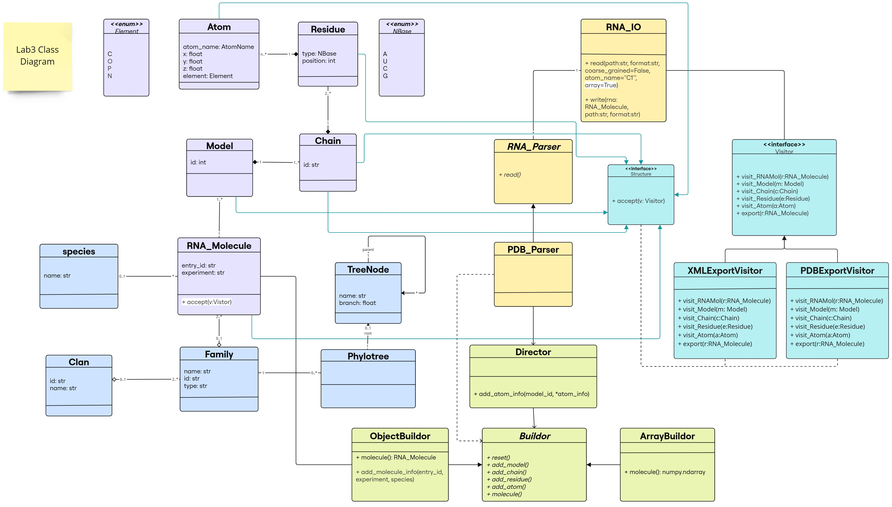

# Lab 3 Report

## Table of contents

- [Lab 3 Report](#lab-3-report)
  - [Table of contents](#table-of-contents)
  - [First Implementation](#first-implementation)
    - [Class Diagram for the Previous-Model-Extension](#class-diagram-for-the-previous-model-extension)
    - [Object Diagram for the Previous-Model-Extension](#object-diagram-for-the-previous-model-extension)
    - [1. Parser returns a numpy array](#1-parser-returns-a-numpy-array)
  - [Main Implementation using Design Patterns](#main-implementation-using-design-patterns)
    - [Demo](#demo)
    - [Library Structure](#library-structure)
    - [Class Diagram](#class-diagram)
    - [Object Diagram](#object-diagram)
    - [1. Builder Design Pattern](#1-builder-design-pattern)
      - [iii. ObjectBuilder class](#iii-objectbuilder-class)
      - [iv. ArrayBuilder class](#iv-arraybuilder-class)
    - [2. Visitor Design Pattern](#2-visitor-design-pattern)
  - [Advantages and Disadvantages](#advantages-and-disadvantages)
    - [For the Builder Design Pattern](#for-the-builder-design-pattern)
    - [For the Visitor Design Pattern](#for-the-visitor-design-pattern)

## First Implementation

**This implementation is in the branch `previous-model-extension `.**

In this lab, we extended our previous model to include the following functionalities:
- The parser returns a numpy array representation of the molecule.
- Writing structures into PDML/XML format.

First, we kept our previous model and extended it with the minimal changes possible without using the design patterns. 

### Class Diagram for the Previous-Model-Extension 


The new changes are highlighted in white.

### Object Diagram for the Previous-Model-Extension


### 1. Parser returns a numpy array

For this, we added a function in the `Processor` class called: `createArray()` that returns the required numpy array representation of an `RNA Molecule` that can have multiple models. 

Note: In our previous implementation, the parser will store the atom information in a list `atoms` inside the `Processor` class.

**createArray()** in `Processor` class:
- Returns a numpy array representation of the molecule
- Dimension: `(number of models, max_residues_no, max_atoms_per_residue_no, 3)` 
- Stores the x,y,z coordinates of each atom.
- Implementation notes:
  - To find the number of models we checked the model_id of the last atom in the atoms list. 
  - We had to loop through the list of atoms to find the maximum number of residues among all models and the maximum number of atoms per residue.
  - Considering that the same atom in a residue can have different coordinates (alternate locations), we stored the coordinates of the atom that has the highest occupancy.
  - The array is filled with nan values where there is no atom information.

**read() in `PDB_Parser` class:**
We added a boolean argument `array` to the `read()` function and set it to `True` by default. If the argument is `True`, the function will return the numpy array representation of the molecule, otherwise it will create the molecule object as before. We did not change anything in the `read()` function, we just added the following at the end:

```python
if array:
    return processor.createArray()
else:         
    return processor.createMolecule() 
```

**Code Usage**
An example can be found in the notebook [reading.ipynb](./demo/reading.ipynb). 
We read a molecule that contains 1 model and another molecule that contains multiple models, and showed the resulting arrays. 
A brief example:

```python
rna_io=RNA_IO()

pdb_path_test=pathify_pdb("7eaf")

mol=rna_io.read(pdb_path_test, "PDB")

print(mol.shape)
print(mol[0, -1, 0, :])
```

The output: 
```
(1, 94, 24, 3)
[-10.06    7.177 -49.234]
```
---

## Main Implementation using Design Patterns

The implementation of the classes is available in the [src](https://github.com/rna-oop/2425-m1-geniomhe-group-6/tree/main/lab3/src) directory in the `main` branch. 

### Demo

For a demonstration of the Builder Design Pattern, you can check the notebook [reading.ipynb](./demo/reading.ipynb). 


### Library Structure

In this lab, we added `Processing` module that contains `builders` and `visitors` submodules. 

The classes are organized in modules and submodules as follows:

```text
src/
├── Families
│   ├── __init__.py
│   ├── clan.py
│   ├── family.py
│   ├── species.py
│   └── tree.py
|
├── IO
│   ├── RNA_IO.py
│   ├── __init__.py
|   |
│   ├── parsers
│   │   ├── PDB_Parser.py
│   │   ├── RNA_Parser.py
│   │   └── __init__.py
|   |
│   └── writers
│       ├── PDB_Writer.py
│       ├── RNA_Writer.py
│       └── __init__.py
|
├── Processing
│   ├── __init__.py
|   |
│   ├── builders
│   │   ├── Director.py
│   │   ├── Builder.py
|   |   ├── ObjectBuilder.py
|   |   ├── ArrayBuilder.py
│   │   └── __init__.py
|   |
│   └── visitors
│       └── __init__.py
|
├── Structure
│   ├── Atom.py
│   ├── Chain.py
│   ├── Model.py
│   ├── RNA_Molecule.py
│   ├── Residue.py
│   └── __init__.py 
|
└── utils.py
```


### Class Diagram



### Object Diagram


### 1. Builder Design Pattern

In this lab, we used the `Builder` design pattern to separate the construction of the RNA molecule object from its representation.

**Modifications done to `PDB Parser`:**

- Added a new argument `array=True` to the `read()` function to return the numpy array representation of the molecule.
  
- Instead of using the `Processor` class to create the molecule object when reading the PDB file, we used the `Director` class and the corresponding `Builder` class. 
   ```python
    director = Director()

    if array == True:
        builder = ArrayBuilder()
    else:
        builder = ObjectBuilder()

    director.builder = builder

    ```

- Instead of `processor.molecule_info()` that used to store the molecule info (id, experiment, species), we added a new method in the `ObjectBuilder` class called `add_molecule_info()` that adds the molecule info to the molecule object, and we used it in the `PDB_Parser`'s `read() function` as follows:
    ```python
    if array==False:
            builder.add_molecule_info(*molecule_info)
    ```

- Instead of `processor.atom_info` that used to store the atom info, we now use `director.add_atom_info(model_id, *atom_info)` which serves as a recipe to build the corresponding molecule.

- Finally, instead of `processor.createMolecule()` that creates only an object, we return `builder.molecule` to get the built molecule that can be an object or a numpy array depending on the builder used.

#### i. Director

- The `Director` class serves as a director for the `Builder` classes. 

- **Attributes:**
    - `__builder`: The builder object that will be used to build the object. Initialized to `None`.

- **Methods:**
    - @property `builder`: Returns the builder object.
    - @builder.setter `builder`: Sets the builder object after checking if it is an instance of the `Builder` class.
    - `add_atom_info`: serves as a common recipe on how to build the molecule for the different `Builder` classes:
        ```python
            def add_atom_info(self, model_id, *atom_info):
            atom_name, x, y, z, element, residue_name, residue_id, chain_id, altloc, occupancy, temp_factor, i_code, charge = atom_info
            self.builder.add_model(model_id)
            self.builder.add_chain(chain_id)
            self.builder.add_residue(residue_name, residue_id, i_code)
            self.builder.add_atom(atom_name, x, y, z, element, altloc, occupancy, temp_factor, charge)
        ```
        - The method takes the model_id and atom_info as arguments that are retrieved from the  `Parser` and calls the corresponding methods in the builder object in a specific order to add the model, chain, residue, and atom information.

#### ii. Builder class

- The `Builder` class is an interface, implemented as an abstract class with all its methods being abstract. 

- It defines the methods that the concrete `Builder` classes should implement.

```python

    @property
    @abstractmethod
    def molecule(self):
        pass
    
    @abstractmethod
    def add_atom(self):
        pass
    
    @abstractmethod
    def add_residue(self):
        pass
    
    @abstractmethod
    def add_chain(self):
        pass
    
    @abstractmethod
    def add_model(self):
        pass

    @abstractmethod
    def reset(self):
        pass
```
- The `molecule` method is a property that should return the built molecule object.
- The `reset` method is used to reset the builder object to its initial state.
- The other methods are used to add atom, residue, chain, and model information to the molecule object.

#### iii. ObjectBuilder class

- The `ObjectBuilder` class is a concrete builder class that implements the `Builder` interface.
- It is responsible for constructing the RNA molecule object.

- **Attributes:**
    - `__molecule`: The RNA molecule object that is being built.
    - other private attributes to keep track of the model, chain, and residue ids.
  
- **Methods:**

    - `reset`: Resets the builder object to its initial state:
        - The molecule object is set to an empty RNA molecule object.
        - The model, chain, and residue ids are set to 0.
  
    - `molecule`: @property, returns the built molecule object and resets the builder object.
- 
    - `add_model`: 
        - Creates a new model object with the given model_id and adds it to the molecule object.
        - Sets the model_id attribute to the given model_id.
  
    - `add_chain`: 
        - Retrieves the model object with the current model_id. 
        - Creates a new chain object with the given chain_id and adds it to the model object.
        - Sets the chain_id attribute to the given chain_id.
  
    - `add_residue`: 
        - Retrieves the chain object with the current chain_id from the model object with the current model_id.
        - Creates a new residue object with the given residue arguments and adds it to the chain object.
        - Sets the residue_id attribute to the residue_id of the added residue.
  
    - `add_atom`: 
        - Retrieves the residue object with the current residue_id from the chain object with the current chain_id from the model object with the current model_id.
        - Creates a new atom object with the given atom arguments and adds it to the residue object.  
  
    - `add_molecule_info`: 
        - Additional method specific for this builder.
        - Adds the entry_id, experiment, and species information to the molecule object.
  
#### iv. ArrayBuilder class

- The `ArrayBuilder` class is a concrete builder class that implements the `Builder` interface.

- It is responsible for constructing the numpy array representation of the RNA molecule object:
    - Dimension: `(number of models, max_residues_no, max_atoms_per_residue_no, 3)`
    - Stores the x,y,z coordinates of each atom.
    - Fills the array with nan values where there is no atom information.
  
- **Attributes:**
    - `__array`: A dictionary that stores the atom coordinates for each residue in the molecule.
    - `__model_id`: The current model id.
    - `__residue_id`: The current residue id.
    - `__prev_atom`: A list that stores the previous atom name and occupancy to handle alternate locations.

- **Methods:**

    - `reset`: Resets the builder object to its initial state:
        - The array dictionary is set to an empty dictionary.
        - The model_id and residue_id are set to 0.
        - The prev_atom list is set to empty string for atom_name and 0.0 for occupancy.
  
    - `add_model`: Sets the model_id attribute to the given model_id.
    - `add_chain`: Does nothing.
    - `add_residue`: Sets the residue_id attribute to the given residue_id and initializes the atom list for the residue.
    - `add_atom`: Adds the atom coordinates to the atom list of the current residue in the array dictionary.
        - Handles alternate locations by storing the atom with the highest occupancy.

    - `molecule`: @property, returns the numpy array representation of the molecule. 
        - Finds the maximum number of atoms per residue by taking the maximum length of the atom lists in the array dictionary.
        - Finds the maximum number of residues by taking the maximum residue_id from the keys of the array dictionary.
        - Creates a numpy array with the calculated dimensions and fills it with the atom coordinates.
        - Resets the builder object to its initial state.
        
    - Importance of the `dictionary`:
        - Since we cannot know the maximum dimensions of the numpy array in advance, we used a dictionary to store the atom coordinates for each residue. 
        - The keys are tuples of the form `(model_id, residue_id)` and the values are lists of atom coordinates.
        - This structure allows for easy retrieval and addition of atom coordinates for each residue.
        - The dictionary is cleared after constructing the numpy array.


### 2. Visitor Design Pattern

---

## Advantages and Disadvantages

### For the Builder Design Pattern

What we might consider as a disadvantage of the Builder Design Pattern over the previous implementation:
- The Builder Design Pattern adds complexity to the code by introducing additional classes and methods.
- The previous model just required a single additional method `createArray()` in the `Processor` class to return the numpy array representation of the molecule. 

But on the other hand, it has also introduced many advantages:
- Each representation has its own dedicated builder class, making the code cleaner and more maintainable, especially if more representations are needed in the future. 
- The Builder Pattern enables the direct construction of the required representation without unnecessary intermediate objects.
- It provides a single recipe for the construction, that is common to all representations, which ensures consistency in how different representations are generated, reducing redundancy and potential errors.
- It breaks the construction into smaller steps, making it easier to modify or extend the building process without affecting the entire system, allowing for greater flexibility and maintainability.
  
### For the Visitor Design Pattern


