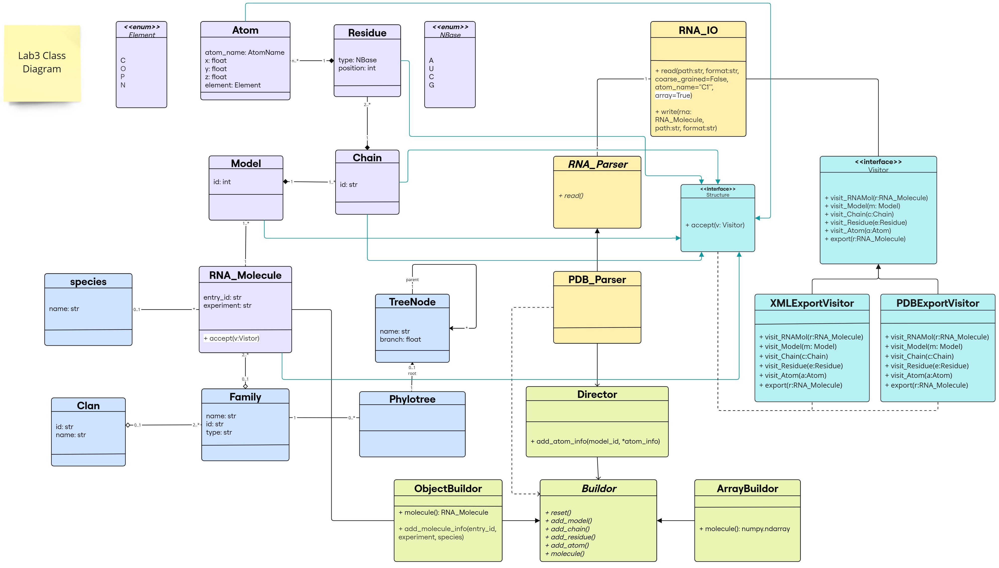
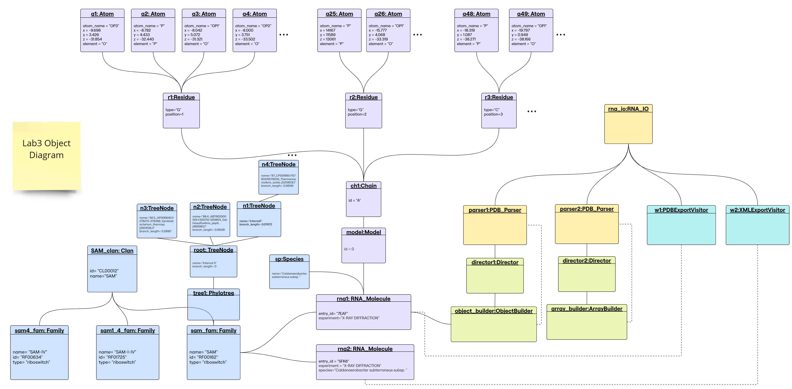

# Lab 4 Report

## Table of contents

- [Lab 4 Report](#lab-4-report)
  - [Table of contents](#table-of-contents)
  - [Added Functionality to Previous Classes](#added-functionality-to-previous-classes)
  - [Demo](#demo)
  - [Class Diagram](#class-diagram)
  - [Object Diagram](#object-diagram)
  - [Library Structure](#library-structure)
  - [Implementation](#implementation)

## Added Functionality to Previous Classes

- The `ArrayBuilder` class now generates an additional array for the RNA sequence alongside the coordinate array. If the RNA molecule contains multiple models, the sequence array will have one sequence per model, maintaining consistency with the coordinate structure.

- A new function `parse_pdb_files` has been added to utils.py. This function takes a list of PDB entries, parses the files, and returns two NumPy arrays:

    - A `coordinate array` with the shape `(number of molecules including models, max number of residues, max number of atoms, 3)`, where missing values are filled with `NaNs`.

    - A `sequence array` containing the RNA sequences for each molecule and model.

## Demo

## Class Diagram



The changes are following this color scheme:
- ***Builder Design Pattern***: light green 
- ***Visitor Design Pattern***: light blue  (classes/interfaces and inheritance links for our predefined classes in purple)
- *methods added to the existing classes*: highlighted in white <span style="background-color:#FFFFFF; display:inline-block; width:10px; height:10px;"></span> 


## Object Diagram




## Library Structure

The classes are organized in modules and submodules as follows:

```text
.
├── Families
│   ├── __init__.py
│   ├── clan.py
│   ├── family.py
│   ├── species.py
│   └── tree.py
├── IO
│   ├── RNA_IO.py
│   ├── __init__.py
│   ├── parsers
│   │   ├── PDB_Parser.py
│   │   ├── RNA_Parser.py
│   │   ├── __init__.py
│   └── visitor_writers        
│       ├── __init__.py
│       ├── pdb_visitor.py
│       ├── visitor.py
│       └── xml_visitor.py
├── Processing                  
│   ├── ArrayBuilder.py
│   ├── Builder.py
│   ├── Director.py
│   ├── ObjectBuilder.py
│   └── __init__.py
├── Structure
│   ├── Atom.py
│   ├── Chain.py
│   ├── Model.py
│   ├── RNA_Molecule.py
│   ├── Residue.py
│   ├── Structure.py		
│   └── __init__.py
└── utils.py

```

## Implementation 

The implementation of the classes is available in the [src](https://github.com/rna-oop/2425-m1-geniomhe-group-6/tree/main/lab4/src) directory in the `main` branch. 