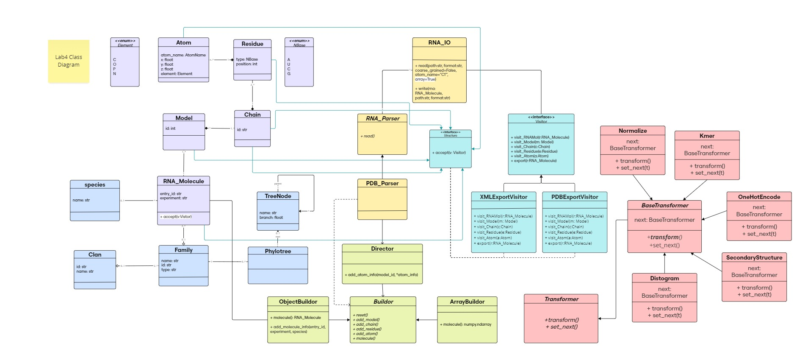
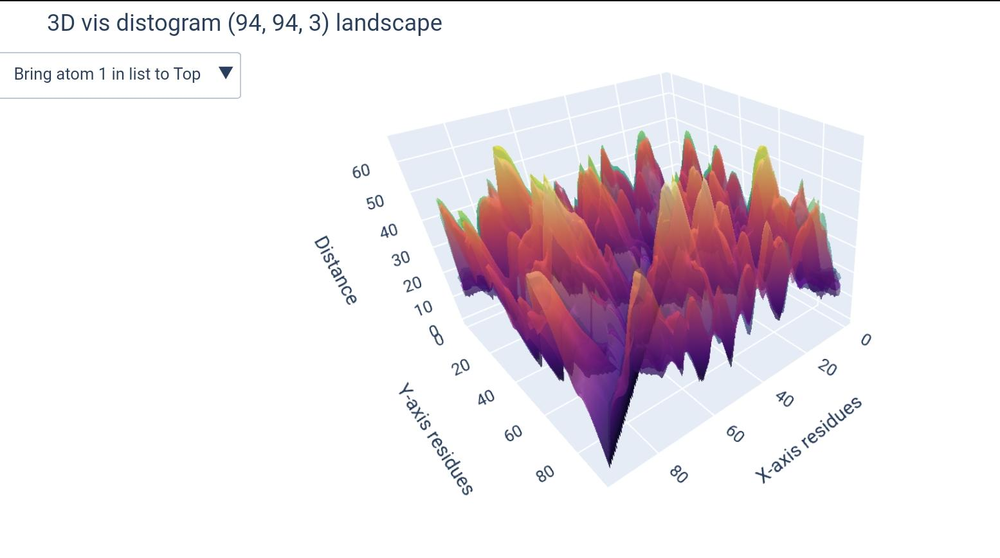
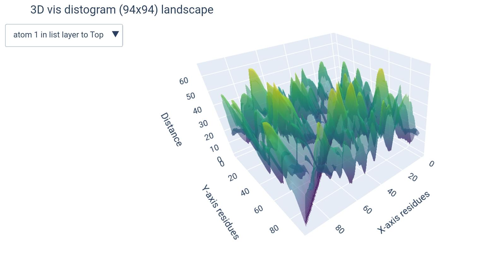
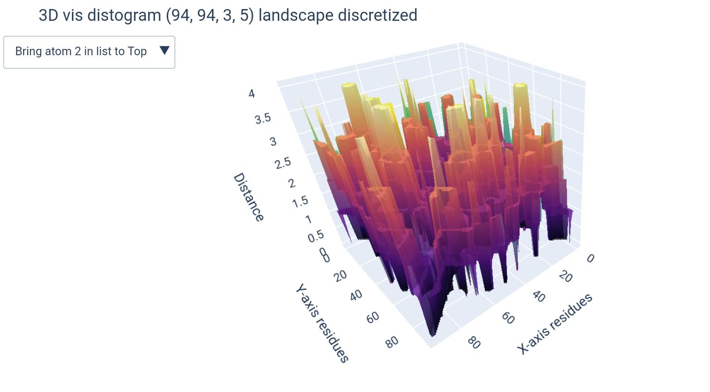
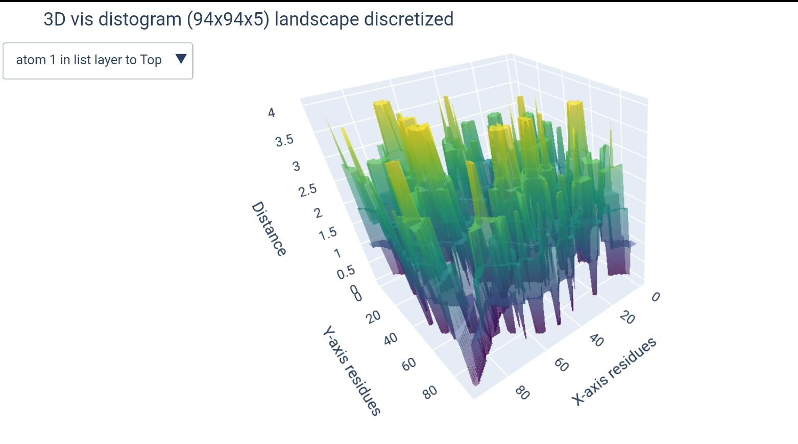

# Lab 4 Report

## Table of contents

- [Lab 4 Report](#lab-4-report)
  - [Table of contents](#table-of-contents)
  - [Added Functionality to Previous Classes](#added-functionality-to-previous-classes)
  - [Demo](#demo)
  - [Class Diagram](#class-diagram)
  - [Object Diagram](#object-diagram)
  - [Library Structure](#library-structure)
  - [Implementation](#implementation)

## Added Functionality to Previous Classes

- The `ArrayBuilder` class now generates an additional array for the RNA sequence alongside the coordinate array. If the RNA molecule contains multiple models, the sequence array will have one sequence per model, maintaining consistency with the coordinate structure.

- A new function `parse_pdb_files` has been added to utils.py. This function takes a list of PDB entries, parses the files, and returns two NumPy arrays:

    - A `coordinate array` with the shape `(number of molecules including models, max number of residues, max number of atoms, 3)`, where missing values are filled with `NaNs`.

    - A `sequence array` containing the RNA sequences for each molecule and model.

## Demo

## Class Diagram



The changes resulting from CoR transformations are added in light red 


## Object Diagram


## Library Structure

The classes are organized in modules and submodules as follows:

```text
.
├── Families
│   ├── __init__.py
│   ├── clan.py
│   ├── family.py
│   ├── species.py
│   └── tree.py
├── IO
│   ├── RNA_IO.py
│   ├── __init__.py
│   ├── parsers
│   │   ├── PDB_Parser.py
│   │   ├── RNA_Parser.py
│   │   └── __init__.py
│   └── visitor_writers
│       ├── __init__.py
│       ├── pdb_visitor.py
│       ├── visitor.py
│       └── xml_visitor.py
├── Processing
│   ├── ArrayBuilder.py
│   ├── Builder.py
│   ├── Director.py
│   ├── ObjectBuilder.py
│   └── __init__.py
├── Structure
│   ├── Atom.py
│   ├── Chain.py
│   ├── Model.py
│   ├── RNA_Molecule.py
│   ├── Residue.py
│   ├── Structure.py
│   └── __init__.py
├── Transformations
│   ├── Pipeline.py
│   ├── __init__.py
│   └── transformers
│       ├── BaseTransformer.py
│       ├── Distogram.py
│       ├── Kmers.py
│       ├── Normalize.py
│       ├── OneHotEncoding.py
│       ├── SecondaryStructure.py
│       ├── TertiaryStructure.py
│       ├── Transformer.py
│       └── __init__.py
├── utils.py
└── viz.py
```

## Implementation 

The implementation of the classes is available in the [src](./src). The added classes are inside the [`Transformations`](./src/Transformations) submodule of out library, where there exists:  
* [`transformers`](./src/Transformations/transformers) submodule, which contains all transformers classes, each as a module in its own .py file 
* [Pipeline](./src/Transformations/Pipeline.py) module, which contains the `Pipeline` class that is responsible for managing the transformation process (interface of teh Chain of Responsibility pattern).

On the side, we created a [`viz`] module at the root of the library to handle all visualization tasks, mainly using `plotly` for interactive visualizations that can be saved as either HTML or PNG files.


### Design Pattern: CoR

Chain of Responsibilty (CoR) design pattern is used to decouple the sender and receiver of a request. It s passed along a chain of handlers until one of them handles it.

### Transformer interface

### BaseTransformer abstract class

### Concrete transformers

#### Normalize

#### Kmers

#### OneHotEncoding

#### Distogram

a Distogram is a matrix that represents the distances between pairs of residues in a molecule. It is a useful representation for understanding the spatial arrangement of atoms in a protein or RNA structure, and can be considered as a label for a 3D structure in machine learning models (since it's describing the spatial sequence).

In our library, there exists a y transformation to generate this distance matrix. It would take from the user: 

- [x] list of atoms
- [x] number of buckets, if any were given _(bonus)_

> [!NOTE]
> In our model we have some specifications to mention in the design of such matrix, prior to implementation:

* `atoms list`: According to the PDB file format documentation: "ATOM records for proteins are listed from amino to carboxyl terminus. Nucleic acid residues are listed from the 5' to the 3' terminus." [^1]. Thus there is no consensus on the order of atoms enlisted, moreover, some atoms may be missing, others can be nucleic residue specific (found in A not in G). For that, the input atom list are indices of atoms, since the order from 5' to 3' is the only generalizable and relevant order, this way the user can specify he/she wants the 1st, 3rd and 5th atoms to be included this way: `[1, 3, 5]` and the order will be respected.
* `dimensions & buckets`: We have chosen to go for the model `(L x L x k)` to represent distogram given k atoms. For that purpose, when the user enters only one atom, it will be automatically turned down into a 2-dimensional `(L x L)` ndarray. Additionally, when a number of buckets is specified, another dimension will be added, making it either `(L x L x k x b)` or `(L x L x b)` depending whether it's for a list of atoms or a single atom, respectively.

We went for this m=because it makes more sense to compare residue vs residue distances, and this way each atom will represent a residue in a different distogram.  
_i.e., each `(L x L)` matrix will represent the distances between residues given one atom as representative, all concatenated in a 3D matrix `(L x L x k)`._ 

```python
from viz import view_distogram
from Transformations.transformers.Distogram import Distogram

X, y # -- given a loaded PDB in form of ndarray
atoms_list: Union[int, List[int]] # -- list of atoms to be used (or 1 atom as int)
buckets: Optional[int] # -- number of buckets to be used (optional)

X, y = Distogram().transform(X, y)
view_distogram(distogram(y['Distogram'], atoms = atoms_list, b = buckets))
```

how different matrices would look like (+dimension of teh output ndarray):

| `( L x L x k )` | `( L x L )`|
|-----------------|------------|
|  |  |
| `(L x L x k x b)` | `(L x L x b)` |
|  | |

[^1]: wwPDB file format documentation _https://www.wwpdb.org/documentation/file-format-content/format33/sect9.html_


> [!CAUTION]
> IMPORTANT POINT ON CHANGE of y TYPE TO DICTIONARY

...

#### SecondaryStructure
