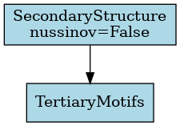

# Lab 4 Report

In this lab, we have implemented bonus questions that were mentioned:

- [x] "Bonus: you can further bucketize the distances to fit a machine learning classification problem like in AlphaFold" 
- [x] "Bonus: You can also detect tertiary motifs like hairpins, loops, and pseudoknots"

In addition to what's required, we have also added:
- 2ary structure transformation into a dot-bracket notation by implementing `Nussinov` algorithm as an extra option
- a `viz` module where we created visualization functions for all kind of RNA structure representations (will be displayed throughout the report)

## Table of contents

- [Lab 4 Report](#lab-4-report)
  - [Table of contents](#table-of-contents)
  - [Added Functionality to Previous Classes](#added-functionality-to-previous-classes)
  - [Demo](#demo)
  - [Class Diagram](#class-diagram)
  - [Object Diagram](#object-diagram)
  - [Library Structure](#library-structure)
  - [Implementation](#implementation)
    - [Design Pattern: CoR](#design-pattern-cor)
    - [Pipeline class](#pipeline-class)
    - [Transformer interface](#transformer-interface)
    - [BaseTransformer abstract class](#basetransformer-abstract-class)
    - [Concrete transformers](#concrete-transformers)
      - [Normalize](#normalize)
      - [Kmers](#kmers)
      - [OneHotEncoding](#onehotencoding)
      - [Distogram](#distogram)
      - [SecondaryStructure](#secondarystructure)
      - [TertiaryMotifs](#tertiarymotifs)

## Added Functionality to Previous Classes

- The `ArrayBuilder` class now generates an additional array for the RNA sequence alongside the coordinate array. If the RNA molecule contains multiple models, the sequence array will have one sequence per model, maintaining consistency with the coordinate structure.

- A new function `parse_pdb_files` has been added to utils.py. This function takes a list of PDB entries, parses the files, and returns two NumPy arrays:

    - A `sequence array` with the shape `(number of molecules including models, max number of residues)`, where missing values are filled with `""`.
    - A `coordinate array` with the shape `(number of molecules including models, max number of residues, max number of atoms, 3)`, where missing values are filled with `NaNs`.


## Demo

[](./demo/pipeline.ipynb)

[](./demo/visualization.ipynb)

## Class Diagram


The changes resulting from CoR transformations are added in light red 
The new functionality of the `ArrayBuilder` class return function is highlighted in white. 


## Object Diagram


## Library Structure

The classes are organized in modules and submodules as follows:

```text
.
├── Families
│   ├── __init__.py
│   ├── clan.py
│   ├── family.py
│   ├── species.py
│   └── tree.py
├── IO
│   ├── RNA_IO.py
│   ├── __init__.py
│   ├── parsers
│   │   ├── PDB_Parser.py
│   │   ├── RNA_Parser.py
│   │   └── __init__.py
│   └── visitor_writers
│       ├── __init__.py
│       ├── pdb_visitor.py
│       ├── visitor.py
│       └── xml_visitor.py
├── Processing
│   ├── ArrayBuilder.py
│   ├── Builder.py
│   ├── Director.py
│   ├── ObjectBuilder.py
│   └── __init__.py
├── Structure
│   ├── Atom.py
│   ├── Chain.py
│   ├── Model.py
│   ├── RNA_Molecule.py
│   ├── Residue.py
│   ├── Structure.py
│   └── __init__.py
├── Transformations
│   ├── Pipeline.py
│   ├── __init__.py
│   └── transformers
│       ├── BaseTransformer.py
│       ├── Distogram.py
│       ├── Kmers.py
│       ├── Normalize.py
│       ├── OneHotEncoding.py
│       ├── SecondaryStructure.py
│       ├── TertiaryStructure.py
│       ├── Transformer.py
│       └── __init__.py
├── utils.py
└── viz.py
```

## Implementation 

The implementation of the classes is available in the [src](./src). The added classes are inside the [`Transformations`](./src/Transformations) submodule of the library, where there exists:  
* [`transformers`](./src/Transformations/transformers) submodule, which contains all transformers classes, each as a module in its own .py file 
* [Pipeline](./src/Transformations/Pipeline.py) module, which contains the `Pipeline` class that is responsible for managing the transformation process (interface of the Chain of Responsibility pattern).

On the side, we created a [`viz`] module at the root of the library to handle all visualization tasks, mainly using `plotly` for interactive visualizations that can be saved as either HTML or PNG files.


### Design Pattern: CoR

Chain of Responsibilty (CoR) design pattern is used to decouple the sender and receiver of a request. 
In our case, the request is the transformation of the input and output data, and the sender is the `Pipeline` class, which is responsible for managing the transformation process. The receiver is the transformer classes, which implement the transformation logic.
The CoR pattern allows us to create a chain of transformers, where each transformer transforms the data and pass it to the next transformer in the chain. This allows for a flexible and extensible design, where new transformers can be added or removed without affecting the rest of the code.

### Pipeline class

The `Pipeline` class is responsible for managing the transformation process. 
- It takes a list of transformers as input, ensures that they are valid transformer classes, and that the first transformer is a `Normalize` transformer (if present).
- It sets the next transformer in the chain for each transformer, allowing for a flexible and extensible design.  
- The `transform` method starts the transformation process from the first transformer in the chain, passing the input data (X, Y) through each transformer in sequence.
- The `__repr__` method provides a string representation of the pipeline, including the names and parameters of each transformer in the chain.

**NOTE**:
`X`, `Y` are the sequences numpy array `(number of molecules including models, max number of residues)` and the coordinates numpy array `(number of molecules including models, max number of residues, max number of atoms, 3)` respectively. 


_This pipeline chains the transformations in form of a __LinkedList__ rather than a __Directed Acyclic Graph__ as is the case in `sklearn`, which is logical since this data structure is enforced by the CoR design pattern that supports a `next` pointer to the next transformer._ 
_When printing the pipeline, `__repr__` will be called which is implemented recursively in the `BaseTransformer` class to display the links:_

<p align='center'>

</p>

### Transformer interface

The `Transformer` interface defines the contract for all transformer classes. It specifies the methods that must be implemented by any transformer class, including:
- `set_next`: Sets the next transformer in the chain.
- `transform`: Transforms the input data (X, Y) and returns the transformed data.

### BaseTransformer abstract class

The `BaseTransformer` class is an abstract class that serves as a base for all transformers. 
- It implements the `Transformer` interface and provides the default behavior for chaining transformers.
- It has a `_next_transformer` attribute that holds the next transformer in the chain.
- The `set_next` method sets the next transformer in the chain and returns it.
- The `transform` method performs the transformation and passes the data to the next transformer in the chain.
  
### Concrete transformers

The concrete transformers are the classes that implement the transformation logic. Each transformer class inherits from the `BaseTransformer` class and implements the `transform` method to perform the specific transformation.

#### Normalize


Normalization is a common preprocessing step in machine learning that involves scaling the input data to a standard range. In the context of RNA sequences, normalization can be used to ensure that the input data is consistent and comparable across different sequences. This is particularly important when working with RNA sequences of varying lengths, in which case, normalization will either pad or crop the sequences to a fixed length.

By default, when several sequnces are read at once (`parse_pd_files(a:list)` function in utils), the sequences are padded to the length of the longest sequence. Normalize will crop to match the length of the smallest sequence, to get rid of as many gaps possible. It takes a boolean parameter `crop`. 

> [!IMPORTANT]
> This transformation can only be used as the 1st transformation in the pipeline, since it's not changing nature of data, only length of one dimension. An error in pipeline is thrown if it's not the case.

This being said, this is the only transformation whose output can be used as an input to all others.

```python
X, y = Normalize().transform(X, y)
```

params:
- X: 2d array of sequences `a x b`
- y: 4d array of pdb structure (defined in prev labs) `a x b x c x 3`

return:
- X: 2d array of sequences `a x min_length`
- y: 4d array of pdb structure `a x min_length x c x 3`


#### Kmers


Kmers are a common way to represent sequences in bioinformatics. They are contiguous subsequences of length k within a longer sequence. For example, the sequence "AUGC" has the following kmers of size 2: `AU`, `UG`, `GC` (always considered with overalps). The number of kmers of length k in a sequence of length L is $L-k+1$.
This transformation is done on the _sequence_ level (X). It will split the sequence into kmers: given an X which is `no_sequences x length_seq` 2d array of base pairs, it will return a 2d array of kmers of size `no_sequences x (length_seq-k+1)` of kmers.

Thus, takes as input raw sequence (or normalized), 2d array and returns a 2d array as well, which _can only serve as an input to one-hot encoding (see next section)_.

```python
X, y = Kmers(k=2).transform(X, y)
```

params: 
- X: 2d array of sequences
- y: 4d array of coordinates

return:
- X: 2d array of kmers
- y: y

#### OneHotEncoding


One hot encoding is a common technique used in machine learning to represent categorical variables as binary vectors. In the context of RNA sequences, one hot encoding can be used to represent the four nucleotides (A, U, C, G) as binary vectors (of size 4).  

In fact, this can be done either on the nucleotide level or on **Kmers** level. It will indicate the presence of a specific nucleotide or Kmer in the sequence. For example, the sequence "AUGC" can be represented as:

|seq| A | U | G | C |
|---|---|---|---|---|
| A | 1 | 0 | 0 | 0 |
| U | 0 | 1 | 0 | 0 |
| G | 0 | 0 | 1 | 0 |
| C | 0 | 0 | 0 | 1 |

Kmers of size 2 have the following representation:

|seq| AA | AC | AU | AG | CA | CC | CU | CG | UA | UC | UU | UG | GA | GC | GU | GG |
|-|-|-|-|-|-|-|-|-|-|-|-|-|-|-|-|-|
| AA | 1 | 0 |0 |0 | 0 | 0 | 0 | 0 | 0 | 0 | 0 | 0 | 0 | 0 | 0 | 0 |
| AC | 0 | 1 |0 | 0| 0 | 0 | 0| 0| 0| 0| 0| 0| 0| 0| 0| 0|
...
...
| GG | 0 | 0| 0 | 0|0|0|0|0|0|0|0|0|0|0|0|1|

> [!TIP] 
> A generalized point of view would be to say that it's always encoding kmers, with the possibility of having a size 1 kmer (nucleotide level). A formalism that we have followed in implementation to allow for encoding the output of a previous kmer transformation as well as the raw sequence fo nucleotides (considered kmer=1 transformation).


The way to run:

```python
X, y = OneHotEncoding().transform(X, y)

# -- viz option
view_one_hot(X,y)
```


| encoding raw X | encoding Kmer transformed X (k=2) |
|----------------|----------------------------------|
|  |  |

> [!IMPORTANT]
> The output of this transformation will change the dimensionality of teh original input, that was once `no_sequences x length_seq` 2d array, into a `no_sequences x (length_seq-k+1) x 4^k` 3d array. This output can not be considered as an input for Kmer transformation, for this purpose, we overrided the `set_next` method of `BaseTransformer` class to allow for a resitriction on the type of transformer to follow the chain of transformations; likewise, can not be input to 2ary or 3ary structure transformation.

```python
    def set_next(self, transformer):
        if isinstance(transformer, Kmers) or isinstance(transformer, TertiaryMotifs):
            raise ValueError(f"OneHotEncoding transformer cannot be followed by {type(transformer)} transformer.")
        return super().set_next(transformer)
```

<!-- <div style="display: flex; align-items: center;">
    
    
</div> -->

params:
- X: 2d array of sequences, or 2d array of kmers
- y: 4d array of coordinates

return:
- X: 3d array of one-hot encoded sequences, or 3d array of one-hot encoded kmers
- y: y

#### Distogram

a Distogram is a matrix that represents the distances between pairs of residues in a molecule. It is a useful representation for understanding the spatial arrangement of atoms in a protein or RNA structure, and can be considered as a label for a 3D structure in machine learning models (since it's describing the spatial sequence).

In our library, there exists a y transformation to generate this distance matrix. It would take from the user: 

- [x] list of atoms
- [x] number of buckets, if any were given _(bonus)_

> [!NOTE]
> In our model we have some specifications to mention in the design of such matrix, prior to implementation:

* `atoms list`: According to the PDB file format documentation: "ATOM records for proteins are listed from amino to carboxyl terminus. Nucleic acid residues are listed from the 5' to the 3' terminus." [^1]. Thus there is no consensus on the order of atoms enlisted, moreover, some atoms may be missing, others can be nucleic residue specific (found in A not in G). For that, the input atom list are indices of atoms, since the order from 5' to 3' is the only generalizable and relevant order, this way the user can specify he/she wants the 1st, 3rd and 5th atoms to be included this way: `[1, 3, 5]` and the order will be respected.
* `dimensions & buckets`: We have chosen to go for the model `(L x L x k)` to represent distogram given k atoms. For that purpose, when the user enters only one atom, it will be automatically turned down into a 2-dimensional `(L x L)` ndarray. Additionally, when a number of buckets is specified, another dimension will be added, making it either `(L x L x k x b)` or `(L x L x b)` depending whether it's for a list of atoms or a single atom, respectively.

We went for this m=because it makes more sense to compare residue vs residue distances, and this way each atom will represent a residue in a different distogram.  
_i.e., each `(L x L)` matrix will represent the distances between residues given one atom as representative, all concatenated in a 3D matrix `(L x L x k)`._ 

```python
from viz import view_distogram
from Transformations.transformers.Distogram import Distogram

X, y # -- given a loaded PDB in form of ndarray
atoms_list: Union[int, List[int]] # -- list of atoms to be used (or 1 atom as int)
buckets: Optional[int] # -- number of buckets to be used (optional)

X, y = Distogram().transform(X, y)
view_distogram(distogram(y['Distogram'], atoms = atoms_list, b = buckets))
```

how different matrices would look like (+dimension of teh output ndarray):

| `( L x L x k )` | `( L x L )`|
|-----------------|------------|
|  |  |
| `(L x L x k x b)` | `(L x L x b)` |
|  | |

[^1]: wwPDB file format documentation _https://www.wwpdb.org/documentation/file-format-content/format33/sect9.html_


> [!CAUTION]
> IMPORTANT POINT ON CHANGE of y TYPE TO DICTIONARY

This model tries to take input data that can either be sequence or structure, and generally in a machine learning model we'd want to consider the structure as a label y, and the sequence as a feature X. Since we are having many transformations on the y, this is similar to having a _multi-labeled_ classification problem[^2]; the labels do not get transformed successively, but rather we generate different representation of it and we'd want to save them all. Due to non consistent dimenionality between the different transformations output, the best and most efficient way to save them all is through a dictionay, whose key describes the transformation and the value is the output of the transformation. 

[^2]: scikit-multilearn: multi-label classification in python _http://scikit.ml/_

#### SecondaryStructure

The `SecondaryStructure` class is responsible for predicting the secondary structure of RNA sequences using one of two methods:
  1- `Nussinov Algorithm` → A dynamic programming algorithm that maximizes base pairing given a sequence of nucleotides.
  2- `Watson-Crick Distance Constraints` → Uses distance constraints based on known base-pair distances in RNA structures.

**Attributes**:
- `nussinov` (`bool`): Specifies the algorithm to use (default: `False`).

**Public Method**:
- `transform`: public method that takes as input `X, Y` and returns X and transformed Y as a dictionary with the original coordinates and the secondary structure in dot-bracket notation. It checks if the input data is a NumPy array and converts it to a dictionary if necessary. It then calls the appropriate method to compute the secondary structure based on the value of `nussinov`.
  
**Private Methods**:
- `_CoM`: Computes the center of mass for each residue in the input data, handling NaN values.
- `_distograms`: Computes the distance matrices for each sequence, handling NaN values.
- `_WDistances_batch`: Computes the secondary structure using Watson-Crick distance constraints for a batch of sequences.
- `__WDistances`: Implements the Watson-Crick distance constraints for secondary structure prediction for a single sequence.
- `_nussinov_batch`: Processes a batch of sequences for the Nussinov algorithm.
- `__nussinov`: Implements the Nussinov algorithm for RNA secondary structure prediction for a single sequence.
- `__traceback`: Constructs the secondary structure from the DP table generated by the Nussinov algorithm.
- `__repr__`: Provides a string representation of the transformer, including the name and parameters of the transformer.

**Visualization**:
3 possible representations:
  - base pair arcs (`matplotlib`):
  
  - base pair circular network (`networkx`,`pyvis`)
  
  - base pair 2D rna structure (`draw_rna`) 
  

#### TertiaryMotifs

The `TertiaryMotifs` class identifies **tertiary motifs** in RNA sequences based on their **secondary structure**. It detects **hairpins, internal loops, and bulges** from **dot-bracket notation**. 

***Public Methods***:
- `set_next(next_transformer)`: Ensures `SecondaryStructure` is processed first not next, otherwise raises an error.
- `transform(X, Y)`: detects tertiary motifs in the input data. It checks if the input data is a NumPy array and converts it to a dictionary if necessary. It then calls the `_detect_motifs` method to identify the motifs in the secondary structure. It returns X, and the transformed Y as a dictionary with the original coordinates, secondary structure and adds to it the detected motifs as a dictionary with keys indices of the sequences and values are the detected motifs as dictionaries with keys as the type of motif and values as the indices of the residues in the sequence.

***Private Methods***:
- `_detect_motifs(dot_bracket, motifs)`: Calls the private methods to detect hairpins, internal loops and bulges in the secondary structure.
- `_detect_hairpins(dot_bracket, motifs)`: Identifies **hairpin loops**.
- `_detect_loops(dot_bracket, motifs)`: Detects **internal loops and bulges**.

***Approach used to detect motifs***:
1. **Hairpin Detection**  
   - Uses a **stack** to track **paired bases**.  
   - Identifies **hairpins** when a **closing parenthesis** appears after a sequence of **dots (`'.'`)**, ensuring the loop meets a **minimum size threshold**
  

2. **Internal Loop & Bulge Detection**  
   - Traverses the **dot-bracket sequence** while maintaining previous **paired positions**.  
   - **Internal loops** are detected when two **consecutive base pairs** enclose an unpaired **loop region** on both sides.
     
   - **Bulges** are identified when **one side** of a base pair has unpaired nucleotides while the other remains paired.
    
 
